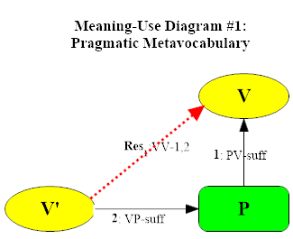
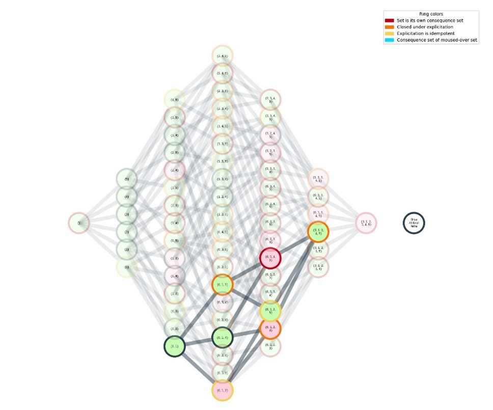
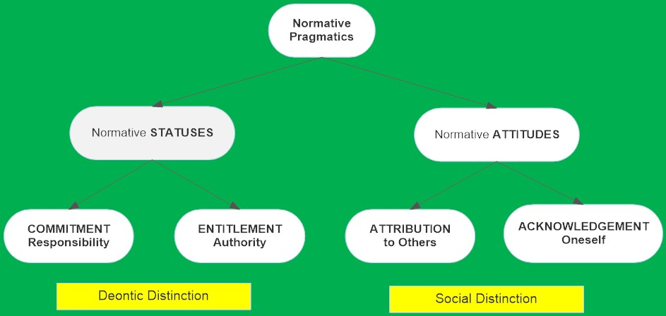
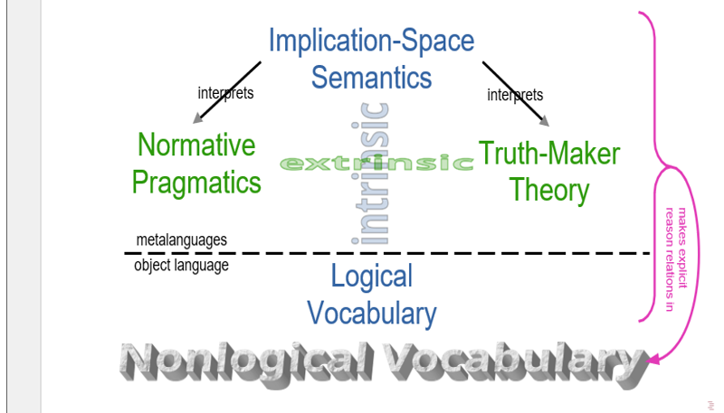

## Course Description

The course will offer an overview of the inferentialist strategy of understanding meaning in the sense of conceptual content in terms of the role linguistic expressions play in reasoning—from its historical origins in classical rationalism to the most recent results in formal implication-space semantics. Along the way we will read chunks of _Making It Explicit_, _Between Saying and Doing_, and Pitt Ph.D. (2016) Ulf Hlobil’s and Bob Brandom’s jointly authored 2024 book _Reasons for Logic, Logic for Reasons_. Central topics include the relations between pragmatics and semantics (theories of use and theories of meaning) and the relations between inferentialist and representationalist semantics (the latter represented by Kit Fine’s hyperintensional truth-maker semantics).

## Meeting 1: August 28, 2024

Introduction to the Course:  
Philosophy, Norms, and Reasons. Two Traditions in the Philosophy of Language.

##### Suggested reading

[What Is Philosophy? (Lecture 1 in _Commitments and Concepts_, pp. 3-21).](meeting1/Commitments.pdf)

##### Supplementary

- [_Articulating Reasons_ Introduction, pp. 1-35](meeting1/Articulating.pdf)
- [_Reasons for Logic, Logic for Reasons_ (2024), Front Matter](meeting1/RLLR-front.pdf)

##### Meeting 1 Materials

- [Video of Meeting 1](https://www.youtube.com/watch?v=jb3jJ0tiKNE&t=6869s)

## Meeting 2: September 4, 2024

Vocabularies and Metavocabularies

##### Suggested reading

[_Reasons for Logic, Logic for Reasons_ (2024), Introduction.](meeting2/RLLR-intro.pdf)

##### Supplementary

- ["Vocabularies of Pragmatism" Chapter 8 of _Rorty and His Critics_ (2000), pp. 156-182.](meeting2/Brandom-Rorty.pdf)
- ["Extending the Project of Analysis" Chapter 1 of _Between Saying and Doing_ (2008).](meeting2/BSD.pdf)
- [Rorty "Private Irony and Liberal Hope" Chapter 4 of _Contingency, Irony, and Solidarity_ (1989](meeting2/Rorty-CIS.pdf)

##### Meeting 2 Materials

- [Handout for Meeting 2](meeting2/Week2-notes.pdf)
- [Video of Meeting 2](https://www.youtube.com/watch?v=pUD7p6OOp0E)
- [Bob's Notes for Week 2](meeting2/Week2-notes.pdf)
- [Announcement of imminent international meeting on RLLR and related books.](https://sce-cse.recherche.usherbrooke.ca/2024-annual-booklaunch/)

## Meeting 3: September 11, 2024

A Minimal Two-Sorted Deontic Bilateral Normative Pragmatic Metavocabulary for Reason Relations

##### Suggested reading

[_Reasons for Logic, Logic for Reasons_ (2024), Chapter 1.](meeting3/RLLR-1.pdf)

##### Supplementary

- [MacFarlane "In What Sense (if Any) Is Logic Normative for Thought?" (2004).](meeting3/Macfarlane.pdf)
- [Simonelli "Why Must Incompatibility Be Symmetric?" (2024).](meeting3/Simonelli.pdf)

##### Background

- [Harman "Logic and Reasoning" (1984)](meeting3/Harman.pdf)
- [Restall "Multiple Conclusions" (2004)](meeting3/Restall.pdf)

##### Meeting 3 materials

- [Handout for Meeting 3](meeting3/Week3-notes.pdf)
- [Video of Meeting 3](https://www.youtube.com/watch?v=9niIreWP67Q)
- [Bob's Notes for Week 3](meeting3/Week3-notes.pdf)
- [Announcement of imminent international meeting on _RLLR_ and related books.](https://sce-cse.recherche.usherbrooke.ca/2024-annual-booklaunch/)

## Meeting 4: September 18, 2024

Bimodal Conceptual Realism

##### Suggested reading

- ["A Tune Beyond Us, Yet Ourselves" (2024).](meeting4/Brandom-ATBUYO.pdf)
- [_Reasons for Logic, Logic for Reasons_ (2024), Chapter 4.](meeting4/RLLR-4.pdf)

##### Supplementary

- [Hlobil, "Laws of Thought and Laws of Truth as Two Sides of One Coin" (2021).](meeting4/Hlobil-Laws.pdf)
- [Fine, "A Theory of Truthmaker Content I: Conjunction, Disjunction, and Negation" (2017).](meeting4/Fine-TM1.pdf)
- [Fine, "A Theory of Truthmaker Content II: Subject-Matter, Common Content, Remainder and Ground" (2017).](meeting4/Fine-TM2.pdf)

##### Meeting 4 materials

- [Outline for Meeting 4](meeting4/Week4-outline.pdf)
- [Handout for Meeting 4](meeting4/Week4-handout.pdf)
- [Video of Meeting 4](https://www.youtube.com/watch?v=LukAgiZpn1c)
- [Bob's Notes for Week 4](meeting4/Week4-notes.pdf)

---

## Facilities Cancellation September 25, 2024

---

## No Class October 2, 2024

---

## Meeting 5: October 9, 2024

The Open Structure of Material Reason Relations

##### Suggested reading

[_Reasons for Logic, Logic for Reasons_ (2024), Chapter 2.](meeting3/RLLR-1.pdf)

##### Supplementary

- [Price, "Why 'Not'?"](meeting5/Price-WN.pdf)
- [Brandom "An Introduction to Hegelian Logic and Metaphysics"](meeting5/Brandom-UOSTN.pdf)
- [Hlobil "Choosing your Nonmonotonic Logic: A Shopper's Guide"](meeting5/Hlobil-NL.pdf)

##### Meeting 5 materials

- [Handout for Meeting 5](meeting5/Week5-handout.pdf)
- [Video of Meeting 5](https://www.youtube.com/watch?v=MBxtNuB3Wpo)
- [Bob's Notes for Meeting 5](meeting5/Week5-notes.pdf)

## Meeting 6: October 16, 2024

Logical Expressivism and Expressivist Logic

##### Suggested reading

[_Reasons for Logic, Logic for Reasons_ (2024), Chapter 3.](meeting6/RLLR-3.pdf)

##### Supplementary

- ["Semantic Inferentialism and Logical Expressivism" (Chapter 1 of _Articulating Reasons_).](meeting6/Brandom-AR.pdf)
- [_Substructural Content_ Dan Kaplan's Pitt Ph.D. Dissertation 2022.](meeting6/Kaplan-diss.pdf)
- [Brandom "From Logical Expressivism to Expressivist Logics"](meeting6/Brandom-FLETEL.pdf)

##### Meeting 6 materials

- [Handout for Meeting 6](meeting6/Week6-handout.pdf)
- [Video of Meeting 6](https://www.youtube.com/watch?v=78e0ISVCND4)
- [Bob's Notes for Meeting 6](meeting6/Week6-notes.pdf)

## Meeting 7: October 23, 2024

Implication-Space Semantics: The Pure Theory of Conceptual Roles

##### Suggested reading

[_Reasons for Logic, Logic for Reasons_ (2024), Chapter 5.](meeting7/RLLR-5.pdf)

##### Meeting 7 materials

- [Handout for Meeting 7](meeting7/Week7-handout.pdf)
- [Video of Meeting 7](https://www.youtube.com/watch?v=Zx-0oU-YKTI)
- [Bob's Notes for Meeting 7](meeting7/Week7-notes.pdf)

## Meeting 8: October 30, 2024

The Metaphysics of Normativity and the Social Dimension of Discursive Practice

##### Suggested reading

["The Fine Structure of Autonomy and Recognition" (Lecture 1 of Brentano Lectures--2019)](meeting8/Brandom-Brentano1.pdf)

##### Supplementary

- ["A Social Route from Reasoning to Representing" (Chapter 5 of _Articulating Reasons_).](meeting8/Brandom_AR_5.pdf)
- ["Ascribing Propositional Attitudes" (Chapter 8 of _Making It Explicit_).](meeting8/Brandom_MIE_Ch8.pdf)
- [Appendix on iterated _de re/de dicto_ ascriptions of propositional attitude, from _Making It Explicit_.](meeting8/Brandom_MIE_Ch8_appendix.pdf)

##### Meeting 8 materials

- [Handout for Meeting 8](meeting8/Week8-handout.pdf)
- [Outline of Meeting 8](meeting8/Week8-outline.pdf)
- [Video of Meeting 8](https://www.youtube.com/watch?v=-qIDQaPh_ys&pp=0gcJCQQLAYcqIYzv)
- [Bob's Notes for Meeting 8](meeting8/Week8-notes.pdf)

## Meeting 9: November 6, 2024

Empirical and Historical Dimensions of Conceptual Content:  
Normative Governance and Subjunctive Tracking. Recollection and Explicitation.

##### Suggested reading

["Representation, Expression, and Recollection" (Lecture 2 of Brentano Lectures--2019)](meeting9/Brandom-Brentano2.pdf)

##### Supplementary

- ["A Speculative Synthesis" _Reasons for Logic, Logic for Reasons_, Epilogue.](meeting9/RLLR_Epilogue.pdf)

##### Meeting 9 materials

- [Handout for Meeting 9](meeting9/Week9-handout.pdf)
- [Video of Meeting 9](https://www.youtube.com/watch?v=BiGveLXCmx8)
- [Bob's Notes for Meeting 9](meeting9/Week9-notes.pdf)

## Meeting 10: November 13, 2024

Semantically Significant Essentially Subsentential Structure I:  
What Are Singular Terms, and Why Are There Any?

##### Suggested reading

- ["What Are Singular Terms, and Why Are There Any?" (Chapter 4 of _Articulating Reasons_).](meeting10/Brandom-AR-Ch4.pdf)
- ["Substituton: What Are Singular Terms, and Why Are There Any", Chapter 6 of _MIE_.](meeting10/Brandom-MIE-Ch6.pdf)

##### Meeting 10 materials

- [Handout for Meeting 10](meeting10/Week10-handout.pdf)
- [Video of Meeting 10](https://www.youtube.com/watch?v=7KzmLWCK5d8)

## Meeting 11: November 20, 2024

Semantically Significant Essentially Subsentential Structure (and Substructure) II:  
Dissecting Reason Relations with a Substitutional Scalpel

##### Suggested reading

- [Van Fraassen "Quantification as an Act of Mind" (1982)](meeting11/Fraassen-Quantification.pdf)
- [Brandom "Singular Terms and Sentential Sign Designs" (1987)](meeting11/Brandom-SingularTerms.pdf)
- [Hlobil "Subsentential Syntax (ROLE Note 192)" (2024)](meeting11/Hlobil-Subsentential_syntax.pdf)

##### Supplementary

- [Fine: "Neutral Relations" (2000)](meeting11/Fine_Neutral-Relations.pdf)
- [Macbride: "Neutral Relations Revisited" (2007)](meeting11/Macbride_Neutral-Relations.pdf)
- [Quine: "Shoenfinkel on the Building-Blocks of Mathematical Logic" (1924)](meeting11/Quine-Schonfinkel.pdf)
- [Brandom: A Binary Sheffer Operator that Does the Work of Quantifiers and Sentential Connectives" (1979)](meeting11/Brandom_Binary-Sheffer-Operator.pdf)
- [Brandom: "The Significance of Complex Numbers for Frege's Philosophy of Mathematics" (2002)](meeting11/Brandom_Complex-Numbers.pdf)

##### Meeting 11 materials

- [Handout for Meeting 11](meeting11/Week11-handout.pdf)
- [Introductory Notes for Meeting 11](meeting11/Week11-notes.pdf)
- [Video of Meeting 11](https://www.youtube.com/watch?v=IIu6FX1LRzk&t=6784s&pp=0gcJCQQLAYcqIYzv)

---

## No Class November 27, 2024

Thanksgiving Holiday Break

---

## Meeting 12: December 4, 2024

Cutting Finer than Substitution: Token Recurrence Structures  
Conclusion

##### Suggested reading

- ["Anaphora: The Structure of Token Repeatables", Chapter 7 of _Making It Explicit_.](meeting12/Brandom_MIE-PartTwo.pdf)
- [_Reasons for Logic, Logic for Reasons_, Chapter 6, Conclusion.](meeting12/RLLR-Chapter6.pdf)

##### Supplementary

- [Brandom: "Reference Explained Away" (1984)](meeting12/Brandom_Reference-Explained-Away.pdf)
- [_Reasons for Logic, Logic for Reasons_, Endmatter (Bibliography and Index).](meeting12/RLLR_Bibliography-and-Index.pdf)

##### Meeting 12 materials

- [Handout for Meeting 12](meeting12/Week12-handout.pdf)
- [Notes for Meeting 12](meeting12/Week12-notes.pdf)
- [Video of Meeting 12](https://www.youtube.com/watch?v=RiNRh7jwxPg)
