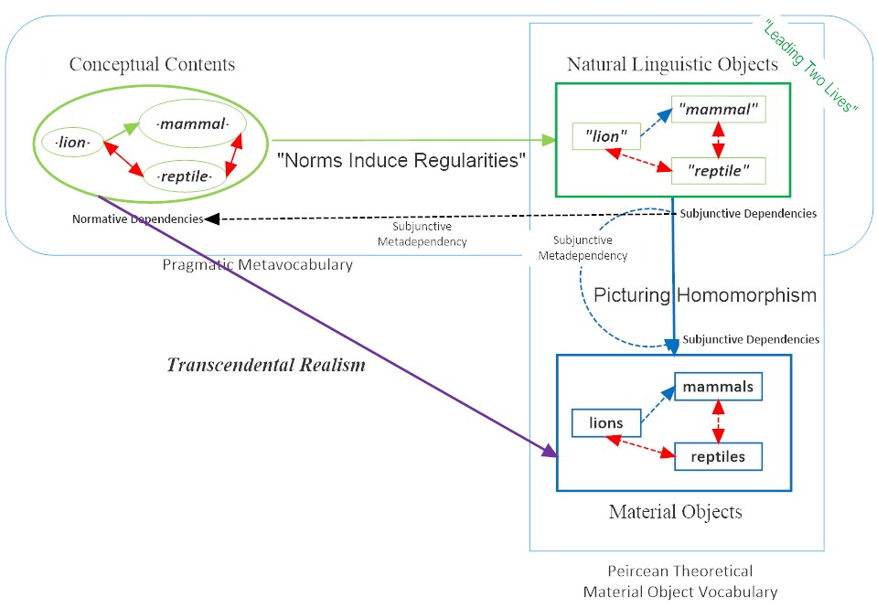
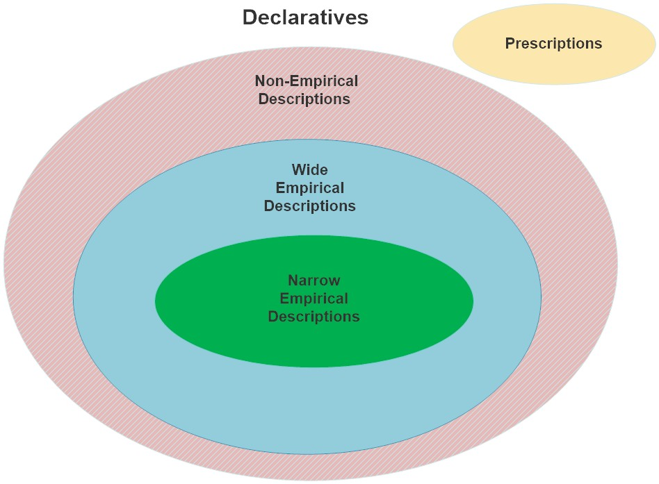

## Course Overview

Wilfrid Sellars was both the most systematic and the most historically minded philosopher of his
generation. He was also the most important heir to the neo-Kantian tradition represented in
America by his predecessors and heroes C.I. Lewis and Rudolph Carnap. This seminar looks at
his mature system as a whole, in the shape he gave it in his 1965 John Locke Lectures, *Science
and Metaphysics*. Sellars from the beginning took the greatest philosophical challenge to be
describing the relations between norms governing discursive behavior and nature as specified by
the best natural sciences. A particular focus is his astonishing metaphysics, which combines
scientific realism with transcendental idealism. At its core, it will be argued, is his radical
metalinguistic nominalism, which is worked out technically with still unrivalled precision.

## Week 1: August 31, 2023

Introduction to the Course

Sellars's Synoptic Metaphysical Vision in Neo-Kantian Context

[Read Brandom, *From Empiricism to Expressivism*, Introduction, pp. 1-29.](Sellars-texts/FEE.pdf)

##### Week 1 Materials

- [Some Sellars Quotations for Introduction](Sellars-texts/Some-Sellars-Quotes-for-Introduction.pdf)
- [German Neo-Kantians](Sellars-texts/German-NeoKantians-after-1860-e.pdf)
- [Diagram of Sellars's "Synoptic Vision"](Sellars-Overall-Diagram-Mark-3-23-7-29-a.jpg)
- [Handout for Meeting 1: Introduction](Week-by-week-materials/Week-1-Summary-Handout.pdf)
- [Brandom's notes for Meeting 1: Introduction](Week-by-week-materials/Week-1-Notes-23-8-30-c.pdf)
- [Video of Meeting 1: Introduction](https://pitt.hosted.panopto.com/Panopto/Pages/Viewer.aspx?id=425af919-538a-4171-b102-b0700155ae6b)
- [Audio of Meeting 1: Introduction](https://pitt.hosted.panopto.com/Panopto/Pages/Viewer.aspx?id=a148b557-d696-4250-8873-b0710000886d)

##### Supplementary

[Brandom *From Empiricism to Expressivism*, Chapter 1, pp. 30-98.](Sellars-texts/FEE.pdf)

##### Some Sellars Resources

- [Sellars Bibliography (with links)](http://www.ditext.com/sellars/bib-s.html)
- [Sellars Archive at Pitt Libraries Archive for Scientific Philosophy](http://digital.library.pitt.edu/cgi-bin/f/findaid/findaid-idx?c=ascead;cc=ascead;q1=sellars;rgn=main;view=text;didno=US-PPiU-asp199101)
- [Sellars Website, by Andrew Chrucky](http://www.ditext.com/sellars/index.html)
- [Wilfrid Sellars Society](http://www.facebook.com/people/Wilfrid-Sellars-Society/100069994808078/)
- [wilfridsellars.org](http://wilfridsellars.org)
- [Sellars *Science, Perception, and Reality* (SPR--1963).](Sellars-texts/Sellars-Wilfrid-Science-Perception-and-reality.pdf)
- [Sellars *Pure Pragmatics and Possible Worlds* (PPPW--1980).](Sellars-texts/PPPW.pdf)
- [Miscellaneous Sellars Pictures (PPPW--1980).](https://sites.pitt.edu/~rbrandom/Courses/MiscSellarsiana%20b.html)

## Week 2: September 7, 2023

Normative Inferential Functionalism

- [Read Sellars, "Some Reflections on Language Games" (SRLG--1951).](Sellars-texts/Some-Reflections-on-Language-Games.pdf)
- [Read Sellars, "Language, Rules, and Behavior" (LRB--1949).](Sellars-texts/Language-Rules-and-Behavior-1949.pdf)
- [Read Sellars, "Inference and Meaning" (IM--1953).](Sellars-texts/Inference-and-Meaning.pdf)

##### Week 2 Materials

- [Handout for Meeting 2: LRB and SRLG Passages](Week-by-week-materials/LRB-and-SRLG-Passages-23-9-3-a.pdf)
- [Handout for Meeting 2: Inference and Meaning Passages](Week-by-week-materials/Inference-and-Meaning-Passages-23-9-3-a.pdf)
- [Advice for Participants for Meeting 2](Week-by-week-materials/Advice-for-participants-23-9-4-a.pdf)
- [Plan for Week 2](Week-by-week-materials/Plan-for-Week-2-23-9-5-a.pdf)
- [Brandom's notes for Meeting 2: Normativity and Discursive Practice](Week-by-week-materials/Week-2-Notes-Mark-2-23-9-7-l.pdf)
- [Video of Meeting 2: Normativity and Discursive Practice](https://pitt.hosted.panopto.com/Panopto/Pages/Viewer.aspx?id=2f5c4800-eba6-4a61-95cc-b07701424390)
- [Audio of Meeting 2: Normativity and Discursive Practice](https://pitt.hosted.panopto.com/Panopto/Pages/Viewer.aspx?id=bbec0448-95f9-4cf3-bf81-b077017bd14c)

##### Supplementary

- [Read Sellars, "Meaning as Functional Classification" (MFC--1974).](Sellars-texts/Meaning-as-Functional-Classification.pdf)
- [Brandom *Making It Explicit* Chapter One (Section III and Appendix) (1994).](Sellars-texts/brandom-making-it-explicit_Chapter-One.pdf)
- [McDowell, "Wittgenstein on Following a Rule" (1984).](Sellars-texts/McDowell-Wittgenstein-on-followingRule-1984.pdf)
- [Sellars, "Language as Thought and as Communication" (LTC--1969).](Sellars-texts/Language-as-Thought-and-as-Communication.pdf)
- [Brandom "The Pragmatist Enlightenment and Its Problematic Semantics"](Sellars-texts/The_Pragmatist_Enlightenment_and_its_Pro.pdf)

## Week 3: September 14, 2023

Epistemology: The Myth of the Given and 'Looks'-talk

- [Read Sellars, "Empiricism and the Philosophy of Mind" (EPM--1956), §1-§38](Sellars-texts/SellarsEmpPhilMind.pdf)
- [Read Brandom, Study Guide to *EPM* (through §38)](Sellars-texts/EPMGuide11496a.pdf)

##### Week 3 Materials

- [Passages from *Empiricism and the Philosophy of Mind*](Week-by-week-materials/Passages-from-EPM.pdf)
- [Plan for Week 3](Week-by-week-materials/Week-3-Plan-23-9-14-a.pdf)
- [Brandom's notes for Week 3. Epistemology: The Myth of the Given and 'Looks'-talk.](Week-by-week-materials/Week-3-Notes-Mark-2-23-9-14-i.pdf)
- [Video of Meeting 3. Epistemology: The Myth of the Given and 'Looks'-talk.](https://pitt.hosted.panopto.com/Panopto/Pages/Viewer.aspx?id=523ae234-1082-4c9a-a473-b07e0147e4e9)
- [Audio of Meeting 3. Epistemology: The Myth of the Given and 'Looks'-talk.](https://pitt.hosted.panopto.com/Panopto/Pages/Viewer.aspx?id=e5362932-2669-480d-965d-b07e01757224)

##### Supplementary Material

- [Read Sellars Carus Lectures (1981) Lecture I: "The Lever of Archimedes"](Sellars-texts/Sellars-Carus-Lectures.pdf)
- [Brandom "The Centrality of Sellars's 2-Ply Account of Observation to *EPM*" (Chapter 2 of *FEE*)](Sellars-texts/FEE.pdf)
- [Simonelli "How to be a Hyper-Inferentialist"](Week-by-week-materials/Simonelli---Hyperinferentialism.pdf)

## Week 4: September 21, 2023

Theoretical Entities in the Philosophy of Mind

- [Read Sellars "Empiricism and the Philosophy of Mind" (EPM--1956), §39-§63.](Sellars-texts/SellarsEmpPhilMind.pdf)
- [Read Sellars "Phenomenalism".](Sellars-texts/Phenomenalism.pdf)

##### Week 4 Materials

- [Handout for Meeting 4: More passages from *EPM*, and from "Phenomenalism".](Week-by-week-materials/Handout-for-Week-4-More-EPM-Passages-plus-Phenomenalism-passages--23-9-16.pdf)
- [Plan for Week 4](Week-by-week-materials/Week-4-Plan-23-9--20-b.pdf)
- [Brandom's notes for Meeting 4: Theoretical Entities in the Philosophy of Mind](Week-by-week-materials/Week-4-Notes-Mark-3-23-9-21-d.pdf)
- [Video of Meeting 4: Theoretical Entities in the Philosophy of Mind](https://pitt.hosted.panopto.com/Panopto/Pages/Viewer.aspx?id=36b00bf0-a083-475c-bfb8-b0840166f3bb)
- [Audio of Meeting 4: Theoretical Entities in the Philosophy of Mind](https://pitt.hosted.panopto.com/Panopto/Pages/Viewer.aspx?id=c3a77965-256f-44ca-a8c4-b085000d44e1)

##### Supplementary Material

- [McDowell, "Why is Sellars's Essay called *Empiricism* and the Philosophy of Mind?" Essay 12 in *Having the World in View*.](Sellars-texts/McDowell-Having-the-World-in-View--Sellars-Essays.pdf)
- [Brandom "Pragmatism, Inferentialism, and Modality in Sellars's Arguments Against Empiricism", Essay 3 in *FEE*.](Sellars-texts/FEE.pdf)
- [Brandom "No Experience Necessary: Empiricism, Non-inferential Knowledge, and Secondary Qualities"](Week-by-week-materials/NEN104e.pdf)
- [Brandom "Fighting Skepticism with Skepticism" (1999)](Week-by-week-materials/Fighting-Skepticism-with-Skepticism.pdf)

## Week 5: September 28, 2023

Nominalism I: Abstraction, Universals, and Ones-in-Many

- [Read Sellars "Grammar and Existence" (GE--1958).](Sellars-texts/Grammar-and-Existence.pdf)
- [Read Sellars "Abstract Entities" (AE--1963).](Sellars-texts/Abstract-Entities.pdf)

##### Week 5 Materials

- [Handout 1 for Meeting 5: Outline of "Grammar and Existence."](Week-by-week-materials/Grammar-and-Existence-Outline-a.pdf)
- [Handout 2 for Meeting 5: GE and AE Passages.](Week-by-week-materials/GE-and-AE-Passages-23-9-22-e.pdf)
- [Plan for Week 5. Nominalism I: Abstraction, Universals, and Ones-in-Many.](Week-by-week-materials/Week-5-Plan-23-9-26-b.pdf)
- [Brandom's notes for Meeting 5. Nominalism I: Abstraction, Universals, and Ones-in-Many.](Week-by-week-materials/Week-5-Notes-Mark-2-23-9-28-m.pdf)
- [Video of Meeting 5. Nominalism I: Abstraction, Universals, and Ones-in-Many.](https://pitt.hosted.panopto.com/Panopto/Pages/Viewer.aspx?id=68b1cd3d-e737-4b1d-8f65-b08b016c0364)
- [Audio of Meeting 5. Nominalism I: Abstraction, Universals, and Ones-in-Many.](https://pitt.hosted.panopto.com/Panopto/Pages/Viewer.aspx?id=7eaa21c2-1a50-4163-9d75-b08c00e03e7e)

##### Supplementary Material

[Quine "On What There Is" (1948)](Sellars-texts/Quine-On_What_There_Is.pdf)

## Week 6: October 5, 2023

Nominalism and Abstraction II: Ontological Nominalism and Nominalization Nominalism, Naming and Saying

- [Read Sellars "Naming and Saying" (NS--1962).](Sellars-texts/Naming-and-Saying.pdf)
- [Read Sellars "Empiricism and Abstract Entities" (1954).](Sellars-texts/Sellars_empiricism_and_abstract_entities.pdf)

##### Week 6 Materials

- [Passages from "Naming and Saying"](Week-by-week-materials/Naming-and-Saying-Passages-23-9-30-a.pdf)
- [The Lvov-Warsaw School of Logic: Principal Figures](Week-by-week-materials/Lvov-Warsaw-School-of-Logic-v2.pdf)
- [Plan for Week 6: Ontological Nominalism and Nominalization Nominalism: Naming and Saying](Week-by-week-materials/Plan-for-Week-6-23-10-4-a.pdf)
- [Brandom's notes for Meeting 6. Ontological Nominalism and Nominalization Nominalism: Naming and Saying](Week-by-week-materials/Week-6-Notes-Mark-2-23-10-5-o.pdf)
- [Video of Meeting 6. Ontological Nominalism and Nominalization Nominalism: Naming and Saying](https://pitt.hosted.panopto.com/Panopto/Pages/Viewer.aspx?id=bc5210d3-e440-44bf-a23a-b09201663c08)
- [Audio of Meeting 6. Ontological Nominalism and Nominalization Nominalism: Naming and Saying](https://pitt.hosted.panopto.com/Panopto/Pages/Viewer.aspx?id=a50b5775-c660-4ca8-8f54-b0930013b80c)

##### Supplementary Material

- [Brandom, "Sellars's Metalinguistic Expressive Nominalism", Chapter 7 of *From Empiricism to Expressivism*.](Sellars-texts/FEE.pdf)
- [Simonelli, "Sellars's Ontological Nominalism".](Sellars-texts/Simonelli-EJP-on-Sellars-Nominalism.pdf)
- [Lear, "The Jumblies".](Week-by-week-materials/The-Jumblies.pdf)

## Week 7: October 12, 2023

Sellars's Pragmatic Metalinguistic Expressivism about Alethic Modality

[Read Sellars "Counterfactuals, Dispositions, and the Causal Modalities" (CDCM--1958), Parts III and IV.](Sellars-texts/Counterfactuals-Dispositions-and-the-Causal-Modalities.pdf)

##### Week 7 Materials

- [Handout for Meeting 7: CDCM Quotations](Week-by-week-materials/CDCM-Quotations.pdf)
- [Plan for Meeting 7: Sellars's Pragmatic Metalinguistic Expressivism about Alethic Modality](Week-by-week-materials/Week-7-Plan-23-10-12-a.pdf)
- [Bob's Notes for Meeting 7: Sellars's Pragmatic Metalinguistic Expressivism about Alethic Modality](Week-by-week-materials/Week-7-Notes-23-10-12-p.pdf)
- [Video of Meeting 7: Sellars's Pragmatic Metalinguistic Expressivism about Alethic Modality](https://pitt.hosted.panopto.com/Panopto/Pages/Viewer.aspx?id=4b25cadc-5899-4e38-b2b3-b09901841d67)
- [Audio of Meeting 7: Sellars's Pragmatic Metalinguistic Expressivism about Alethic Modality](https://pitt.hosted.panopto.com/Panopto/Pages/Viewer.aspx?id=0abf380b-d6d4-4676-89f4-b09a00e117b3)

##### Supplementary Material

- [Brandom, "From Hume and Quine to Kant and Sellars", Chapter 4 of *FEE*.](Sellars-texts/FEE.pdf)
- [Brandom, "Modal Expressivism and Modal Realism: Together Again", Chapter 5 of *FEE*.](Sellars-texts/FEE.pdf)
- [Geach, "Ascriptivism" (1960)](Week-by-week-materials/Geach-Ascriptivism-1960.pdf)

## Week 8: October 19, 2023

Reconciling the Manifest Image and the Scientific Image

- [Read Sellars "Philosophy and the Scientific Image of Man" (PSIM--1962).](Sellars-texts/Sellars-Wilfrid-Science-Perception-and-reality.pdf)
- [Read O'Shea "The Structure of Sellars's Naturalism with a Normative Turn".](Sellars-texts/OSHEA2J2009TheStructureofSellarsNaturalismwithaNormativeTurn.pdf)

##### Week 8 Materials

- [Handout for Meeting 8: Passages from "Philosophy and the Scientific Image of Man"](Week-by-week-materials/PSIM-passages-b.pdf)
- [Plan for Meeting 8: Reconciling the Manifest and Scientific Images](Week-by-week-materials/Week-8-Plan-23-10-18-d.pdf)
- [Notes for Meeting 8: Reconciling the Manifest and Scientific Images](Week-by-week-materials/Week-8-Notes-Mark-2-23-10-19-i.pdf)
- [Video of Meeting 8: Reconciling the Manifest and Scientific Images](https://pitt.hosted.panopto.com/Panopto/Pages/Viewer.aspx?id=e3055dfc-878b-4105-811c-b0a200e93faf)
- [Audio of Meeting 8: Reconciling the Manifest and Scientific Images](https://pitt.hosted.panopto.com/Panopto/Pages/Viewer.aspx?id=e63b6263-6538-4dd0-b2af-b0a201174214)

##### Supplementary Material

- [Sellars, "A Semantical Solution to the Mind-Body Problem" (SSMB--1953)](Sellars-texts/PPPW.pdf)
- [Eddington, "Two Tables", Introduction to his Gifford Lectures *The Nature of the Physical World*, 1927](Sellars-texts/Eddingtons-Gifford-Lectures-1927.pdf)

## Week 9: October 26, 2023

Transcendental Idealism as Scientific Realism: *Science and Metaphysics Part 1*

- [Read Sellars *Science and Metaphysics* (SM--1968) Chapter II.](Sellars-texts/SM-Chapter-Two.pdf)
- [Read Sellars "Truth and Correspondence". (TC--1962)](Sellars-texts/Sellars-Wilfrid-Science-Perception-and-reality.pdf)

##### Week 9 Materials

- [Handout 1 for Meeting 9: Passages from *Science and Metaphysics* Chapter II](Week-by-week-materials/SM-Passages-Handout-23-10-25-a.pdf)
- [Handout 2 for Meeting 9: Passages from "Truth and Correspondence"](Week-by-week-materials/TC-Passages-23-10-21-f.pdf)
- [Plan for Meeting 9: The Metaphysics of Intentionality](Week-by-week-materials/Plan-for-Week-9-23-10-26-a.pdf)
- [Notes for Meeting 9: A Brief History of the Concept of Appearance](Week-by-week-materials/Week-9-Notes-Mark-2-23-10-26-h.pdf)
- [Video of Meeting 9: A Brief History of the Concept of Appearance](https://pitt.hosted.panopto.com/Panopto/Pages/Viewer.aspx?id=83837cd4-fa79-4bcc-9535-b0a7016acc16)
- [Audio of Meeting 9: A Brief History of the Concept of Appearance](https://pitt.hosted.panopto.com/Panopto/Pages/Viewer.aspx?id=68734ecb-e237-4a5d-ac2a-b0a8010f4cb6)

##### Supplementary Material

- [McDowell, Woodbridge Lectures from *Having the World in View*, Essays 1 and 2](Sellars-texts/McDowell-Having-the-World-in-View--Sellars-Essays.pdf)
- [McDowell, "Criteria, Defeasibility, and Knowledge"](Sellars-texts/McDowell-Criteria-Defeasibility-and-Knowledge.pdf)

## Week 10: November 2, 2023

Scientific Realism as Transcendental Idealism: *Science and Metaphysics* Part 2

Transcendental Semantics, Reality, and Conceptual Progress

[Read Sellars *Science and Metaphysics* (SM--1968) Chapter V.](Sellars-texts/SM-Chapter-Five.pdf)

##### Week 10 Materials

- [Handout for Meeting 10: Passages from *Science and Metaphysics* V](Week-by-week-materials/SM-Ch-V-Just-Passages-23-10-31-b.pdf)
- [Plan for Meeting 10: Transcendental Semantics, Reality, and Conceptual Progress](Week-by-week-materials/Plan-for-Week-10-23-10-31-j.pdf)
- [Notes for Meeting 10. *Science and Metaphysics* Ch. V: Transcendental Semantics, Reality, and Conceptual Progress](Week-by-week-materials/Week-10-Notes-Series-4--23-11-3-c.pdf)
- [Video of Meeting 10. *Science and Metaphysics* Ch. V: Transcendental Semantics, Reality, and Conceptual Progress](https://pitt.hosted.panopto.com/Panopto/Pages/Viewer.aspx?id=69edd283-334d-4037-aa4c-b0ae018b1a0b)
- [Audio of Meeting 10. *Science and Metaphysics* Ch. V: Transcendental Semantics, Reality, and Conceptual Progress](https://pitt.hosted.panopto.com/Panopto/Pages/Viewer.aspx?id=8a50b305-c716-44c2-9c77-b0af002ce142)

##### Supplementary Material

- [Brandom "Unsuccessful Semantics" (1994)](Week-by-week-materials/Unsuccessful-Semantics-1994.pdf)
- [Rescher and Brandom *The Logic of Inconsistency* (1980) Selections](Week-by-week-materials/LI-Selections.pdf)

## Week 11: November 9, 2023

More on Picturing: *Science and Metaphysics* Part 3

- [Read Seiberth "The Role of Languagings in Sellars's Theory of Experience" (2021)](Sellars-texts/Seiberth-Role-of-Languagings-essay-2021.pdf)
- [Read Simonelli "Sellars's Two Worlds" (2023)](Sellars-texts/Simonelli-Sellars-Two-Worlds-2023.pdf)

##### Week 11 Materials

- [Handout for Meeting 11: Picturing Diagram](Week-by-week-materials/Picturing-1-23-7-26-b.jpg)
- [Handout for Meeting 11: Passages from Seibarth's "The Role of Languagings in Sellars..."](Week-by-week-materials/Passages-from-Seiberth-on-Languagings-23-11-5-d.pdf)
- [Notes for Meeting 11: Conceptual Appearances, Transcendental Semantics, and Picturing](Week-by-week-materials/Week-11-Notes-Series-2-23-11-10-a.pdf)
- [Video of Meeting 11: Conceptual Appearances, Transcendental Semantics, and Picturing](https://pitt.hosted.panopto.com/Panopto/Pages/Viewer.aspx?id=ef3f23dc-b39e-44cd-9663-b0b5017c2bc1)
- [Audio of Meeting 11: Conceptual Appearances, Transcendental Semantics, and Picturing](https://pitt.hosted.panopto.com/Panopto/Pages/Viewer.aspx?id=2dc33b63-a9c3-4b91-b764-b0b60016fc89)

## Week 12: November 16, 2023

Nominalism and Processes

- [Read Sellars, "Naturalism and Process," Carus Lecture II, pp. 30-56.](Sellars-texts/Sellars-Carus-Lectures.pdf)
- [Read Simonelli, "Sellars's Ontological Nominalism" (2021)](Sellars-texts/Simonelli-EJP-on-Sellars-Nominalism.pdf)

##### Week 12 Materials

- [Handout for Meeting 12: Selected Passages from Carus Lecture II](Week-by-week-materials/Sellars-Carus-Lecture-II-Selected-Passages-23-11-14-k.pdf)
- [Bob's Notes for Meeting 12: Nominalism and Processes](Week-by-week-materials/Week-12-Notes-Series-4-23-11-17-e.pdf)
- [Video of Meeting 12: Nominalism and Processes](https://pitt.hosted.panopto.com/Panopto/Pages/Viewer.aspx?id=71499753-73ae-4580-ace0-b0bc017eaef3)
- [Audio of Meeting 12: Nominalism and Processes](https://pitt.hosted.panopto.com/Panopto/Pages/Viewer.aspx?id=89492cb6-bc25-4834-8746-b0bd0031c52d)

##### Supplementary Material

- [Lewis "Mathematics is Megethology" (1991)](Week-by-week-materials/Lewis-Mathematics_is_Megethology.pdf)
- [Seibt "Pure Processes and Projective Metaphysics" (1998)](Week-by-week-materials/Seibt-Pure_Processes_and_Projective_Metaphysic.pdf)
- [Seibt "Nontransitive Parthood, Mereology, and Processes" (1998)](Week-by-week-materials/Seibt-Nontransitive-Parthood-Mereology-and-Processes.pdf)
- [Dummett *Frege's Philosophy of Language* (FPL--1973) Chapter 14: Abstract Objects](Sellars-texts/Dummett-FPL-Chapter-7.pdf)
- [Goodman and Quine "Steps Towards a Constructive Nominalism" (1947)](Sellars-texts/Goodman-StepsTowardConstructive-1947.pdf)

**No Class November 23, 2023:**

**Thanksgiving Holiday Break**

## Week 13: November 30, 2023

Description, Fact-Stating, and Two Bifurcation Principles

- [Read Brandom, "Modal Expressivism and Modal Realism: Together Again", Chapter 5 of *FEE*.](Sellars-texts/FEE.pdf)

##### Week 13 Materials

- [Plan for Meeting 13: Description, Fact-Stating, and Two Bifurcation Principles](Week-by-week-materials/Week-13-Plan-23-11-28-b.pdf)
- [Handout for Meeting 13: Description, Fact-Stating, and Two Bifurcation Principles](Week-by-week-materials/Week-13-Handout-23-11-29-j.pdf)
- [Bob's Notes for Meeting 13: Description, Fact-Stating, and Two Bifurcation Principles](Week-by-week-materials/Week-13-Notes-Series-2-23-12-1-d.pdf)
- [Video of Meeting 13: Description, Fact-Stating, and Two Bifurcation Principles](https://pitt.hosted.panopto.com/Panopto/Pages/Viewer.aspx?id=be1f44cb-f4cb-44bf-a44a-b0ca018adff9)
- [Audio of Meeting 13: Description, Fact-Stating, and Two Bifurcation Principles](https://pitt.hosted.panopto.com/Panopto/Pages/Viewer.aspx?id=2d531f24-b43f-4052-b210-b0cb00fd7f59)

## Week 14: December 7, 2023

Conclusion

Sellars's Metaphysics: A Divided World

And an Alternative

World-of-Facts, Bimodal Conceptual Realism

##### Week 14 Materials

- [Plan for Meeting 14: Conclusion: Bimodal Conceptual Realism](Week-by-week-materials/Week-14-Plan-23-12-8-a.pdf)
- [Handout for Meeting 14: Conclusion: Bimodal Conceptual Realism](Week-by-week-materials/Week-14-Handout-h.pdf)
- [Bob's Notes for Meeting 14: Conclusion: Bimodal Conceptual Realism](Week-by-week-materials/Week-14-Notes-Series-3--23-12-9-c.pdf)
- [Video of Meeting 14: Conclusion: Bimodal Conceptual Realism](https://pitt.hosted.panopto.com/Panopto/Pages/Viewer.aspx?id=b698053d-36f8-49cf-9e75-b0d30124e7cd)
- [Audio of Meeting 14: Conclusion: Bimodal Conceptual Realism](https://pitt.hosted.panopto.com/Panopto/Pages/Viewer.aspx?id=cac33caf-f33b-42e8-acf2-b0d3015adf57)

##### Supplementary Material

- [Hlobil, "The Laws of Thought and the Laws of Truth as Two Sides of One Coin" (2022)](Week-by-week-materials/Hlobil-Laws-of-Thought-and-Laws-of-Truth.pdf)
- [Fine, "A Theory of Truthmaker Content I" (2017)](Week-by-week-materials/Fine_2017_ATheoryOfTruthmakerContent-I-Con.pdf)
