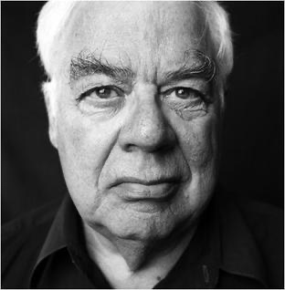
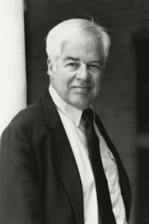
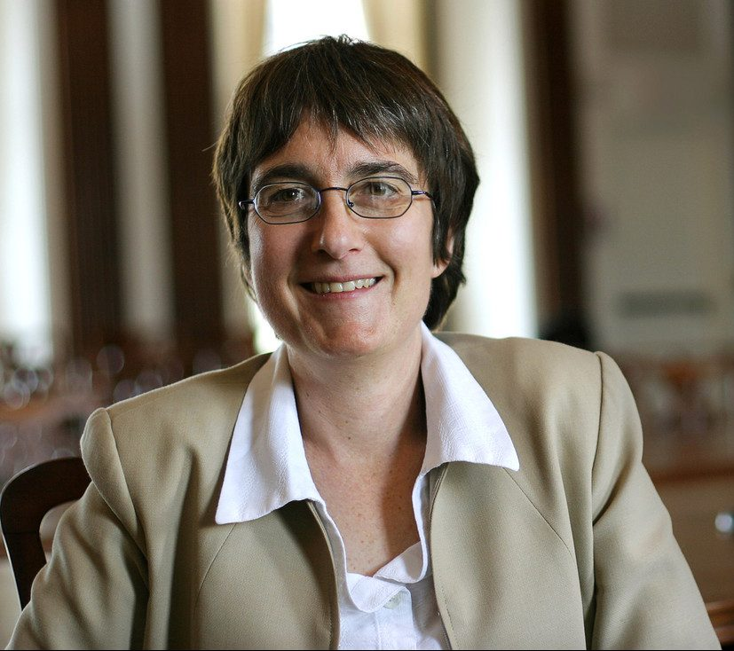
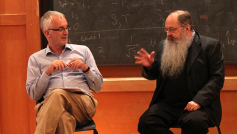

<strong>Two Forms of Contemporary Antirepresentationalism: Pragmatism and Expressivism</strong>

* * *

[Syllabus](pdfs/Syllabus_2695_20-8-10_a.docx)

* * *

## Week 1. August 18, 2020

Introduction. The Concept of Representation

Descriptivism and Semantic Representationalism

Two Kinds of Anti-Representationalism

#### Week 1 Materials

- [Handout for Week 1](pdfs/Handout_Week_1.pdf)
- [Presentation Notes for Week 1](pdfs/Week_1_Presentation_Notes.pdf)
- [Video of Week 1](https://youtu.be/nZdKMV-EFqI)
- [Audio of Week 1](https://pitt.hosted.panopto.com/Panopto/Pages/Viewer.aspx?id=ebcb3fb5-8cd5-49fb-b5aa-ac2001114be7)

* * *

<strong>Part One</strong>

<strong>Antirepresentationalism as Pragmatism:   Richard Rorty and Cheryl Misak</strong>

* * *

## Week 2. August 25, 2020

Rorty’s Critique of Enlightenment Representationalism, and (so) of Analytic Philosophy

- [Read Rorty, _Philosophy and the Mirror of Nature_ (1979) Introduction.](pdfs/Rorty_PMN.pdf)

- [Read Rorty, _Philosophy and the Mirror of Nature_ (1979) Ch. 3.](pdfs/Rorty_PMN.pdf)

- [Read Rorty, _Philosophy and the Mirror of Nature_ (1979) Ch. 4.](pdfs/Rorty_PMN.pdf)

#### Week 2 Materials

- [Handout for Week 2](pdfs/Week_2_Handout_20-8-24_e.pdf)
- [Presentation Notes for Week 2](pdfs/Week_2_Presentation_Notes.pdf)
- [Video of Week 2](https://youtu.be/JxwnATjQKfE)
- [Audio of Week 2](https://pitt.hosted.panopto.com/Panopto/Pages/Viewer.aspx?id=6004ab5d-3f5c-41cf-a93b-ac2400d13ab6)

##### Supplementary

- [Rorty, “The World Well Lost” (1972).](pdfs/Rorty_The_World_Well_Lost.pdf)
- [Bruce Kuklick, “40 Years After Philosophy and the Mirror of Nature” (2019).](pdfs/PMN_40_years_on_kuklick.pdf)

* * *

## Week 3. September 1, 2020

Rorty Finds His Pragmatist Voice

- [Read Rorty, “Pragmatism, Relativism, and Irrationalism” (APA Presidential Address, 1980).](pdfs/Rorty_Pragmatism_Relativism_and_Irrationalism.pdf)
- [Read Rorty, _Consequences of Pragmatism_ (1982) Introduction.](pdfs/Rorty_CP_Introduction.pdf)
- [Read Rorty, “Antirepresentationalism, ethnocentrism, and liberalism” (1991).](pdfs/rorty-objectivity-relativism-and-truth.pdf)
  (which is the Introduction to _Objectivity, Relativism, and Truth_)

- [Read Rorty, “Overcoming the Tradition: Heidegger and Dewey” (1976).](pdfs/Rorty_Overcoming_the_Tradition_Heidegger_and_Dewey.pdf)
- [Read Brandom “An Arc of Thought” (2008).](pdfs/Brandom_An_Arc_of_Thought_From_Rortys_Eliminativ.pdf)

#### Week 3 Materials

- [Handout for Week 3--Some Rorty Quotations](pdfs/Handout_for_Week_3_Some_Rorty_Quotations.pdf)
- [Presentation Notes for Week 3](pdfs/Week_3_Presentation_Notes.pdf)
- [Video of Week 3](https://youtu.be/34RDu7RH89U)
- [Audio of Week 3](https://pitt.hosted.panopto.com/Panopto/Pages/Viewer.aspx?id=4045643c-7369-4093-bc27-ac2a000e1f29)

##### Supplementary

- [John McDowell, “Towards Rehabilitating Objectivity” (in Brandom (ed.) _Rorty and His Critics_, 1999).](pdfs/McDowell_Towards_Rehabilitating_Objectivity_1999.doc)
- [Yvonne Huetter-Almerigi “Two Forms of Realism:Making Sense of Rorty’s Controversy with Brandom and Ramberg over Objectivity” (2020).](pdfs/Two_Forms_of_Realism_Making_Sense_of_Ro.pdf)

* * *

## Week 4. September 8, 2020

Cheryl Misak’s Critique of Rorty’s Pragmatism

- [Read Misak, “Rorty, Pragmatism, and Analytic Philosophy” (2013).](pdfs/Misak_Rorty_Pragmatism_and_Analytic_Philosophy.pdf)
- [Read Misak, “American Pragmatism and Indispensability Arguments” (Presidential Address, 2011).](pdfs/Misak_Presidential_Address_American_Pragmatism.pdf)
- [Read Björn Ramberg, “Being Constructive: Misak’s Creation of Pragmatism” (2013).](pdfs/Ramberg_on_Misaks_Creation_of_Pragmatism.pdf)
- [Read Bruce Kuklick "Who Owns Pragmatism?" (2017).](pdfs/Kuklick_WHO_OWNS_PRAGMATISM.pdf)
- [Read Misak, “Pragmatism and Pluralism” (2005).](pdfs/Misak_Pragmatism_and_Pluralism.pdf)

#### Week 4 Materials

- [Handout for Week 4](pdfs/Handout_for_Week_4_20-9-7_f.pdf)
- [Presentation Notes for Week 4](pdfs/Week_4_Presentation_Notes_20-9-8_p.pdf)
- [Video of Week 4](https://youtu.be/9qgNFPDRE_8)
- [Audio of Week 4](https://pitt.hosted.panopto.com/Panopto/Pages/Viewer.aspx?id=76ba4d9e-fd7e-4957-ad67-ac3100d70265)

##### Supplementary

- [Robert B. Talisse, “Pragmatism Deflated” (on Misak’s Cambridge Platonism, 2018).](pdfs/Talisse_Pragmatism_Deflated_Misak_on_Cambridge_Pragmatism.pdf)
- [Rorty, “Pragmatism Without Method” (from Objectivity, Relativism, and Truth, 1991).](pdfs/rorty-objectivity-relativism-and-truth.pdf)
- [Christopher Hookway “Review of Cheryl Misak’s _The American Pragmatists_” (2013).](pdfs/Hookway_review_of_Misak.pdf)
- [Alan Richardson, “What Good is a (Indeed This) History of Pragmatism”(Review of Misak’s The American Pragmatists, 2013)](pdfs/Richardson_on_Misak_and_Rorty.pdf)
- [Robert B. Talisse, “Recovering American Philosophy” (Review of Misak’s _The American Pragmatists_, 2013).](pdfs/Talisse_on_Misak.pdf)
- [Misak, “Reply to Four Instructive Critics” (2013).](pdfs/Misak_Reply_to_Critics_Ramberg_Richardson_Talisse.pdf)
- [H. O. Mounce “Review of Cheryl Misak’s The American Pragmatists” (2015).](pdfs/Mounce_on_Misak.pdf)

* * *

## Week 5. September 15, 2020

Rorty’s Literary _Kehre_

- [Read Rorty, “Nineteenth Century Idealism and Twentieth Century Textualism” (1981).](pdfs/Rorty_Nineteenth_Century_Idealism_and_Twentieth_Century_Textualism.pdf)
- [Read Brandom "Vocabularies of Pragmatism: Synthesizing Naturalism and Historicism" (1999).](pdfs/Vocabularies_of_Pragmatism_Synthesizing_Naturalism_and_Historicism.doc)
- [\[For short version see:\] Brandom “Rorty on Vocabularies” (2017).](pdfs/Brandom_Rorty_on_vocabularies_in_Revisiting_Rorty.pdf)
- [Read Rorty, “Solidarity or Objectivity?” (Howison Lecture, 1983).](pdfs/Rorty_solidarity-or-objectivity.pdf)

#### Week 5 Materials

- [Handout for Week 5](pdfs/Week_5_Handout_20-9-14_a.pdf)
- [Handout II for Week 5: Rorty's Romanticism](pdfs/Rortys_Romanticism.pdf)
- [Presentation Notes for Week 5](pdfs/Week_5_Presentation_Notes_20-9-15_n.pdf)
- [Video of Week 5](https://youtu.be/8Mi8YvOVSPc)
- [Audio of Week 5](https://pitt.hosted.panopto.com/Panopto/Pages/Viewer.aspx?id=fe5d8f5c-7d48-46f4-b04f-ac3801116fbb)

##### Supplementary

- [Ramberg “For the Sake of His Own Generation: Rorty on Destruction and Edification” (2010).](pdfs/For_the_sake_of_his_own_generation_Rorty.pdf)
- [Ramberg, “Rorty, Davidson, and the Future of Metaphysics in America” (in Cheryl Misak (ed.) _The Oxford Handbook of American Philosophy_, 2008).](pdfs/Rorty_Davidson_and_the_future_of_metaphy.pdf)
- [Christopher Voparil, “Rorty and Brandom: Pragmatism and the Ontological Priority of the Social” (2011). In _Pragmatism Today, Volume 2_](pdfs/Pragmatism_Today_volume_on_Rorty_2011.pdf)
- [Bush, "Nothing Outside the Text: Derrida and Brandom on Language and World"](pdfs/Nothing_Outside_the_Text_Derrida_and_Brandom.pdf)

* * *

## Week 6. September 22, 2020

Rorty’s Political _Kehre_

- [Read Rorty, “Pragmatism as Anti-Authoritarianism” (1999).](pdfs/Rorty_Pragmatism_as_Anti-Authoritarianism_1999.pdf)
- [Read Rorty, Preface to _Pragmatism, a View_ (1999).](pdfs/Rorty_Girona_Preface.pdf)
- [Read Rorty, “Pragmatism as Romantic Polytheism” (Girona Lectures \#2, 1996).](pdfs/Rorty_Second_Girona_Lecture-Pragmatism_as_romantic_polytheism.pdf)
- [Read Brandom, “Achieving the Enlightenment” (Foreword to Richard Rorty, _Pragmatism: A View_, Eduardo Emendieta (ed.), Harvard University Press, forthcoming in 2021.)](pdfs/Brandom_Achieving_Enlightenment_Foreword_to_PaV_AE_20-4-29_a.docx)

#### Week 6 Materials

- [Handout for Week 6](pdfs/Week_6_Handout.pdf)
- [Girona Rorty Poster](images/Rorty_Poster.jpg)
- [Pragmatism: A Version. ToC of Girona Lectures](pdfs/PRAGMATISM-A_VERSION_ToC.docx)
- [Presentation Notes for Week 6](pdfs/Week_6_Presentation_Notes.pdf)
- [Video of Week 6](https://youtu.be/JjjHFAgmWi0)
- [Audio of Week 6](https://pitt.hosted.panopto.com/Panopto/Pages/Viewer.aspx?id=2f57ad74-23ad-4f03-88b7-ac3f00f2ef48)

##### Supplementary

[Rorty, “Pragmatism and Religion” (Girona Lectures \#1, 1996).](pdfs/Rorty_First_Girona_Lecture-Pragmatism_and_Religion.pdf)

* * *

## Week 7. September 29, 2020

Assessing Rorty’s Pragmatism as Anti-Representationalism

- [Read Brandom, “Fetishism, Anti-Authoritarianism, and the Second Enlightenment: Rorty and Hegel on Representation and Reality” (2020).](pdfs/Brandom_FAASE_19-11-23_c.docx)
- [Read Lecture 1: “A Rortyan Master-Argument—Its Premises and Development.”](pdfs/Brandom_FAASE_19-11-23_c.docx)
- [Read Lecture 2: “Hegel’s Recollective Account of Representation.”](pdfs/Brandom_FAASE_19-11-23_c.docx)

#### Week 7 Materials

- [Handout for Week 7](pdfs/Week_7_Handout.pdf)
- [Presentation Notes for Week 7](pdfs/Week_7_Presentation_Notes.pdf)
- [Video of Week 7](https://youtu.be/vl88geBbqew)
- [Audio of Week 7](https://pitt.hosted.panopto.com/Panopto/Pages/Viewer.aspx?id=3020da53-45cd-48f8-95a8-ac4700da25f0)

##### Supplementary

- [Brandom, from _Articulating Reasons_: "A Social Route from Reasoning to Representing" (2000).](pdfs/AR5HUPb.doc)
- [Paul Redding, “Pragmatism, Idealism, and the Modal Menace: Rorty, Brandom, and the Truths about Photons” (2013).](pdfs/Pragmatism_Idealism_and_the_Modal_Menace.pdf)
- [Steven Levine, “Rehabilitating Objectivity: Rorty, Brandom, and the New Pragmatism” (2010)](pdfs/Levine_Rehabilitating_Objectivity_Rorty_Brandom_and_the_New_Pragmatism.pdf)
- [Paul Redding, “Rorty on Hegel on the Mind in History” (2020).](pdfs/Redding_Rorty_on_Hegel_on_the_Mind_in_History.pdf)

* * *

<strong>Part Two</strong>

<strong>Antirepresentationalism as Expressivism:   Huw Price and Simon Blackburn</strong>

* * *

## Week 8. October 6, 2020

Anti-Representationalism, Pragmatism, and Expressivism

- [Read Huw Price, “Naturalism without Representationalism” (2007).](pdfs/Price_Naturalism_without_Representationalism.pdf)
- [Read Huw Price and David Macarthur, "Pragmatism, Quasi-Realism, and the Global Challenge" (from Cheryl Misak, _The New Pragmatists_, 2007).](pdfs/Price_and_Macarthur_Pragmatism_Quasi-Realism_and_the_Global_Challenge.pdf)

#### Week 8 Materials

- [Handout for Week 8](pdfs/Week_8_Handout.pdf)
- [Presentation Notes for Week 8](pdfs/Week_8_Presentation_Notes.pdf)
- [Video of Week 8](https://youtu.be/rlt5PctMRYM)
- [Audio of Week 8](https://pitt.hosted.panopto.com/Panopto/Pages/Viewer.aspx?id=f43fd5c8-4de7-4363-a263-ac4d01093b55)

##### Supplementary

- [Brandom "Expressive vs. Explanatory Deflationism About Truth".](pdfs/Explanatory_vs_Expressive_Deflationism.pdf)
- [Lionel Shapiro, “Linguistic Function and Content: Reflections on Price’s Pragmatism” (2014).](pdfs/Lionel_Shapiro_on_Prices_Pragmatism.pdf)
- [Brandon Beasley, "Naturalism Without a Subject: Huw Price's Pragmatism” (2020).](pdfs/Beasley_Naturalism_without_a_subject_Huw_Prices_pragmatism.pdf)
- [Brandom, "The Significance of Complex Numbers for Frege's Philosophy of Mathematics".](pdfs/Significance-of-Complex-Numbers-for-Frege.pdf)

* * *

## Week 9. October 13, 2020

Huw Price on Representationalism, Rorty, and Expressivism

- [Read Price, “One Cheer for Representationalism” (2008).](pdfs/Price_One_Cheer_for_Repesentationalism_on_Rorty.pdf)
- [Read Price, “Expressivism for Two Voices” (2010).](pdfs/Price_Expressivism_for_TwoVoices_Brandom_Gibbard_Blackburn.pdf)
- [Read Price, "Two Expressivist Programmes, Two Bifurcations” (2013).](pdfs/Price_Two_Expressivist_Programmes_Two_Bifurcations.pdf)
- [Read Simon Blackburn, “Pragmatism: All or Some?” (in Price, _Expressivism, Pragmatism, and Representationalism_ 2013).](pdfs/Blackburn_Representation_Pragmatism_and_Expressivism.pdf)

#### Week 9 Material

- [Handout for Week 9](pdfs/Week_9_Handout.pdf)
- [Presentation Notes for Week 9](pdfs/Week_9_Presentation_Notes.pdf)
- [Video of Week 9](https://youtu.be/yD9SFUrEgt0)
- [Audio of Week 9](https://pitt.hosted.panopto.com/Panopto/Pages/Viewer.aspx?id=3dbca08c-702b-4de9-9cf2-ac5400225545)

##### Supplementary

[David Macarthur, “Pragmatism, Metaphysical Quietism, and the Problem of Normativity” (2008).](pdfs/Macarthur_Pragmatism_Metaphysical_Quietism_and_The.pdf)

* * *

## Week 10. October 20, 2020

Simon Blackburn on Expressivism and Pragmatism

- [Read Blackburn, “Landscapes of Pragmatism” (2009).](pdfs/Blackburn_Landscapes_of_Pragmatism_on_Brandom_and_Price_and_Rorty.pdf)
- [Read Blackburn, “Pragmatism: Some or All or Some and All?” \[Not the same as the essay from Week 9.\]](pdfs/Blackburn_Pragmatism_All_or_Some.docx)

#### Week 10 Materials

- [Handout for Week 10](pdfs/Week_10_Handout.pdf)
- [Handout for Week 10 Part 2 Eliatic Strategies](pdfs/Week_10_Eliatic_Strategies_for_E-Reps_Handout.pdf)
- [Presentation Notes for Week 10](pdfs/Week_10_Presentation_Notes_20-10-20_t.pdf)
- [Video of Week 10](https://youtu.be/KTTPRijIykk) [Audio of Week 10](https://pitt.hosted.panopto.com/Panopto/Pages/Viewer.aspx?id=bb58c8bb-9c9b-467a-a9c5-ac5b0107785e)

##### Supplementary

- [Blackburn, “Wittgenstein, Wright, Rorty and Minimalism” (1998).](pdfs/Blackburn_LW_Wright_Rorty_Minimalism.pdf)
- [Misak, “Deflating Truth: Pragmatism vs. Minimalism” (1998).](pdfs/Misak_on_Minimalism_and_Pragmatism_about_Truth.pdf)
- [Price _Times Arrow_ Chapters 1 and 10 (1996)](pdfs/Price_Times_Arrow_Chs_1_and_10.pdf)
- [Brandom "Reference Explained Away" (1984).](pdfs/Reference-Explained-Away.pdf)

* * *

## Week 11. October 27, 2020

Price on Sellars and McDowell, Blackburn on Brandom and McDowell

- [Read Price: “Wilfrid Sellars Meets Cambridge Pragmatism” (2016).](pdfs/Price_on_Sellars_and_Cambridge_Pragmatism.pdf)
- [Read Price “Idling and Sidling Towards Philosophical Peace” (2010).](pdfs/Idling_and_Sidling_Towards_Philosphical_Peace.pdf)
- [Read Blackburn, “The Steps from Doing to Saying” (Presidential Address to Aristotelian Society, 2009).](pdfs/Blackburn_Steps_from_Doing_to_Saying_NeoPragmatism.pdf)
- [Read Blackburn, “Pragmatism, Minimalism, and the Space of Reasons” (2001).](pdfs/blackburn_pragmatism_minimalism_and_the_space_of_reasons.pdf)

#### Week 11 Materials

- [Handout for Week 11](pdfs/Week_11_Handout_20-10-26_a.pdf)
- [Presentation Notes for Week 11](pdfs/Week_11_Presentation_Notes_20-10-27_r.pdf)
- [Video of Week 11](https://youtu.be/aPLYgxHNS-s)
- [Audio of Week 11](https://pitt.hosted.panopto.com/Panopto/Pages/Viewer.aspx?id=b7fee5e9-1d0f-476a-8e6a-ac62005d3024)

##### Supplementary

[Sarin Marchetti, “Brandom and Pragmatism: Remarks on a Still Open Question” (2016).](pdfs/Marchetti_Brandom_and_Pragmatism_A_Still_Open_Question.pdf)

* * *

## Week 12. November 3, 2020

Price's Pragmatist Philosophy of Language

- [Read Price, “Truth as Convenient Friction” (2003).](pdfs/Price_Truth_as_Convenient_Friction.pdf)
- [Read Price, Rorty “Exchange on ‘Truth as Convenient Friction’” (2005).](pdfs/Price_RortyExchange_on_Truth_as_Convenient_Friction.pdf)
- [Read Price, “Three Norms of Assertibility, or How the MOA Went Extinct” (1998).](pdfs/Price_Assertibility_and_the_Moa.pdf)
- [Read Price, “Why 'Not'?” (1990).](pdfs/Price_Why_Not.pdf)
- [Read Brandom, “Truth and Assertibility” (1976).](pdfs/Truth_and_Assertibility.pdf)

#### Week 12 Materials

- [Handout for Week 12](pdfs/Week_12_Handout_20-11-2_a.pdf)
- [Week 12 Plan](pdfs/Week_12_Plan_20-11-3_d.pdf)
- [Presentation Notes for Week 12](pdfs/Week_12_Presentation_Notes_20-11-3_f.pdf)
- [Video of Week 12](https://youtu.be/Tpf-_v64nog)
- [Audio of Week 12](https://pitt.hosted.panopto.com/Panopto/Pages/Viewer.aspx?id=12381d90-19fc-4c09-9f6b-ac69004ee7ae)

##### Supplementary

- [Price, “Quining Naturalism” (2007).](pdfs/Price_Quining_Naturalism.pdf)
- [Albert Atkin, “Intellectual Hope as Convenient Friction” (2015).](pdfs/Atkin_Intellectual_Hope_as_Convenient_Friction.pdf)
- [Price, “Truth and the Nature of Assertion” (1987).](pdfs/Price_Truth_and_Assertion.pdf)
- [Price, “Metaphysical Pluralism” (1992).](pdfs/Price_Metaphysical_Pluralism.pdf)
- [Michael Williams, “How Pragmatists Can Be Local Expressivists” (in Huw Price, _Expressivism, Pragmatism, and Representationalism_ 2013).](pdfs/Price-Williams_How_Pragmatists_Can_Be_Local_Expressivists.pdf)

* * *

## Week 13. November 10, 2020

Global or Local Expressivism? The Current State of Play

- [Read Brandom, “Global Anti-Representationalism?” (in Huw Price, _Expressivism, Pragmatism, and Representationalism_ 2013).](pdfs/Global_Anti-Representationalism.pdf)
- [Read Price, “From Quasirealism to Global Expressivism – and Back Again?” (2015).](pdfs/Price-From_Quasirealism_to_Global_Expressivism--and_Back_Again.pdf)
- [Read Price, “Global Expressivism by the Method of Differences” (2019).](pdfs/Price_Global_Expressivism_by_Differences.pdf)

#### Week 13 Materials

- [Handout for Week 13](pdfs/Week_13_Handout_20-11-9_a.pdf)
- [Presentation Notes for Week 13](pdfs/Week_13_Presentation_Notes_20-11-10_p.pdf)
- [Video of Week 13](https://youtu.be/V7_j7a3MfKs)
- [Audio of Week 13](https://pitt.hosted.panopto.com/Panopto/Pages/Viewer.aspx?id=59dc1a8c-1cce-404c-b57f-ac71004d8ecf)

##### Supplementary

[Ramberg, “Do Pragmatic Naturalists Have Souls?” (2018).](pdfs/Ramberg_Do_pragmatic_naturalists_have_souls_Shou.pdf)

* * *

## Week 14. November 17, 2020

Conclusion: Rationales and Prospects for Anti-Representationalism

#### Week 14 Materials

- [Handout for Week 14](pdfs/Week_14_Handout_20-11-16_j.pdf)
- [Presentation Notes for Week 14](pdfs/Week_14_Presentation_Notes_20-11-17_q.pdf)
- [Video of Week 14](https://youtu.be/ObVaSlGUbek)
- [Audio of Week 14](https://pitt.hosted.panopto.com/Panopto/Pages/Viewer.aspx?id=075e1ed5-36fa-46bc-bc0c-ac7700d6aac0)

##### Supplementary

[Brandom "The Institution of Normative Statuses by Normative Attitudes" (2019).](pdfs/Brandom_FSAR_19-4-10_a.pdf)

* * *

## Some Further Resources

- [Richard Rorty's webpage, with bibliography](https://www.web.stanford.edu/~mvr2j/rr/)
- [Richard Rorty Society.](https://www.richardrortysociety.org)
- [Rorty, “Intellectual Autobiography” (2010).](pdfs/Richard_Rorty_Intellectual_Autobiography_Schilp_Volume_copy.pdf)
- [Richard Rorty entry in _International Encyclopedia of Social and Behavioral Sciences_.](pdfs/Richard_Rorty.pdf)
- [Rorty, Contingency, Irony, and Solidarity (1989).](pdfs/rorty-contingency-irony-and-solidarity-1989.pdf)
- [The Roots of Rorty’s Philosophy—Pragmatism Today (vol 2, Issue 1, Summer 2011).](pdfs/Pragmatism_Today_volume_on_Rorty_2011.pdf)
- [Pragmatism and Literature—Pragmatism Today (vol2, Issue 2, Winter 2011).](pdfs/Rorty_Romanticism_and_the_Literary_Absol.pdf)
