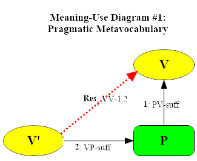

## Introduction

The course will offer an overview of the inferentialist strategy of understanding meaning in the sense of conceptual content in terms of the role linguistic expressions play in reasoning—from its historical origins in classical rationalism to the most recent results in formal implication-space semantics. Along the way we will read chunks of *Making It Explicit*, *Between Saying and Doing*, and Pitt Ph.D. (2016) Ulf Hlobil’s and Bob Brandom’s jointly authored 2024 book *Reasons for Logic, Logic for Reasons*. Central topics include the relations between pragmatics and semantics (theories of use and theories of meaning) and the relations between inferentialist and representationalist semantics (the latter represented by Kit Fine’s hyperintensional truth-maker semantics).

## Meeting 1: August 28, 2024

Introduction to the Course:  
Philosophy, Norms, and Reasons. Two Traditions in the Philosophy of Language.

##### Suggested reading

[What Is Philosophy?](meeting1/Commitments.pdf) – Lecture 1 in *Commitments and Concepts*, pp. 3-21.

##### Supplementary

+ [*Articulating Reasons*](meeting1/Articulating.pdf) - Introduction, pp. 1-35
+ [*Reasons for Logic, Logic for Reasons* (2024)](meeting1/RLLR-front.pdf) - Front Matter

##### Meeting 1 Materials

+ [Video of Meeting 1](https://pitt.hosted.panopto.com/Panopto/Pages/Viewer.aspx?id=b3bfdf63-32dd-4111-baf1-b20501213162)

## Meeting 2: September 4, 2024

Vocabularies and Metavocabularies

##### Suggested reading

[*Reasons for Logic, Logic for Reasons* (2024)](meeting2/RLLR-intro.pdf) - Intro

##### Supplementary

+ ["Vocabularies of Pragmatism"](meeting2/Brandom-Rorty.pdf) - Chapter 8 of *Rorty and His Critics* (2000), pp. 156-182.
+ ["Extending the Project of Analysis"](meeting2/BSD.pdf) - Chapter 1 of *Between Saying and Doing* (2008).
+ [Rorty - "Private Irony and Liberal Hope"](meeting2/Rorty-CIS.pdf) - Chapter 4 of *Contingency, Irony, and Solidarity* (1989)

##### Meeting 2 Materials

+ [Handout for Meeting 2](meeting2/Week2-notes.pdf)
+ [Video of Week 2 Meeting](https://pitt.hosted.panopto.com/Panopto/Pages/Viewer.aspx?id=a09ca9db-7580-4936-b56a-b1e2017eeb72)
+ [Bob's Notes for Week 2](meeting2/Week2-notes.pdf)
+ [Announcement of imminent international meeting on RLLR and related books.](https://sce-cse.recherche.usherbrooke.ca/2024-annual-booklaunch/)

## Meeting 3: September 11, 2024

A Minimal Two-Sorted Deontic Bilateral Normative Pragmatic Metavocabulary for Reason Relations

##### Suggested reading

[*Reasons for Logic, Logic for Reasons* (2024)](meeting3/RLLR-1.pdf) - Chapter 1.

##### Supplementary

+ [MacFarlane "In What Sense (if Any) Is Logic Normative for Thought?" (2004).](meeting3/Macfarlane.pdf)
+ [Simonelli "Why Must Incompatibility Be Symmetric?" (2024).](meeting3/Simonelli.pdf)

##### Background

+ [Harman "Logic and Reasoning" (1984)](meeting3/Harman.pdf)
+ [Restall "Multiple Conclusions" (2004)](meeting3/Restall.pdf)

##### Meeting 3 materials

+ [Handout for Meeting 3](meeting3/Week3-notes.pdf)
+ [Video of Week 3 Meeting](https://pitt.hosted.panopto.com/Panopto/Pages/Viewer.aspx?id=565f3290-5e6b-4645-808a-b1e80160d139)
+ [Bob's Notes for Week 3](meeting3/Week3-notes.pdf)
+ [Announcement of imminent international meeting on RLLR and related books.](https://sce-cse.recherche.usherbrooke.ca/2024-annual-booklaunch/)

## Meeting 4: September 18, 2024

Bimodal Conceptual Realism

##### Suggested reading

+ ["A Tune Beyond Us, Yet Ourselves" (2024)](meeting4/Brandom-ATBUYO.pdf)
+ [*Reasons for Logic, Logic for Reasons* (2024)](meeting4/RLLR-4.pdf) - Chapter 4.

##### Supplementary

+ [Hlobil, "Laws of Thought and Laws of Truth as Two Sides of One Coin" (2021)](meeting4/Hlobil-Laws.pdf)
+ [Fine, "A Theory of Truthmaker Content I: Conjunction, Disjunction, and Negation" (2017).](meeting4/Fine-TM1.pdf)
+ [Fine, "A Theory of Truthmaker Content II: Subject-Matter, Common Content, Remainder and Ground" (2017).](meeting4/Fine-TM2.pdf)

##### Meeting 4 materials

+ [Outline for Meeting 4](meeting4/Week4-outline.pdf)
+ [Handout for Meeting 4](meeting4/Week4-handout.pdf)
+ [Video of Week 4 Meeting](https://pitt.hosted.panopto.com/Panopto/Pages/Viewer.aspx?id=5d842cdc-dc45-4724-967e-b1ef01514a47)
+ [Bob's Notes for Week 4](meeting4/Week4-notes.pdf)

## Facilities Cancellation September 25, 2024

## No Class October 2, 2024

## Meeting 5: October 9, 2024

The Open Structure of Material Reason Relations

##### Suggested reading

[*Reasons for Logic, Logic for Reasons* (2024)](meeting3/RLLR-1.pdf) - Chapter 2.

##### Meeting 5 materials

+ [Handout for Meeting 5](meeting5/Week5-handout.pdf)
+ [Video of Meeting 5](https://pitt.hosted.panopto.com/Panopto/Pages/Viewer.aspx?id=584cfd9a-c499-48cf-b975-b205011dbc1a)
+ [Bob's Notes for Meeting 5](meeting5/Week5-notes.pdf)

##### Supplementary Material

+ [Price, "Why 'Not'?"](meeting5/Price-WN.pdf)
+ [Brandom "An Introduction to Hegelian Logic and Metaphysics"](meeting5/Brandom-UOSTN.pdf)
+ [Hlobil "Choosing your Nonmonotonic Logic: A Shopper's Guide"](meeting5/Hlobil-NL.pdf)

## Meeting 6: October 16, 2024

Logical Expressivism and Expressivist Logic

[*Reasons for Logic, Logic for Reasons* (2024)](meeting6/RLLR-3.pdf) - Chapter 3.

##### Supplementary Material

+ ["Semantic Inferentialism and Logical Expressivism" (Chapter 1 of Articulating Reasons).](meeting6/Brandom-AR.pdf)

test
