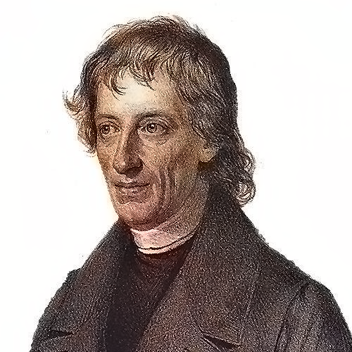
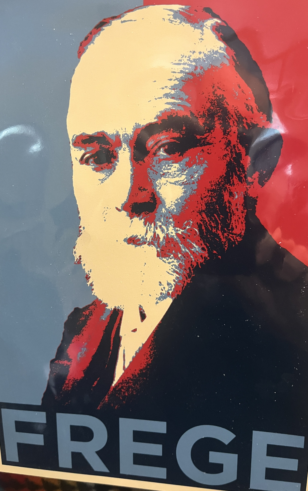

 
   
  

#  
 Frege in Context  

##  
  Bob Brandom--Fall 2025   
  

###  
 Wednesdays at 1pm in 1008 B, Cathedral of Learning 
  
---  
  

   

##  **Week 1.**     August 27, 2025:  Introduction  

### Weekly Materials: 

### [Handout for Week 1](<Week 1 Handout 25-8-26 c.pdf>)

### [Kite of Ampliativity](<Kite 25-8-5.pdf>) 

### [Some Quotations and References from Lecture](<Some Quotations from Week One 25-8-28 c.pdf>) 

### [Video of Week 1](<https://pitt.hosted.panopto.com/Panopto/Pages/Viewer.aspx?id=9646253e-e21b-4262-bdb4-b347000363dd>) 

### [Audio of Week 1](<https://pitt.hosted.panopto.com/Panopto/Pages/Viewer.aspx?id=c0370fb8-da34-4830-bff3-b34701222dd3>) 

###  Background Resources for Introduction:

### [Michael Beaney *Frege Reader* Introduction, pp. 1-14.](<Beaney Frege Reader.pdf>)

###  Background Resources for Context:

### [Alberto Coffa, *The Semantic Tradition from Kant to Carnap: To the Vienna Station* (1991)](<The Semantic Tradition from Kant to Carnap To the Vienna Station by J. Alberto Coffa.pdf>) 

### [Danielle Macbeth, *Realizing Reason* (2014)](<Macbeth Realizing Reason A Narrative of Truth and Knowing.pdf>) 

### [Passages from Kant's *Logic*](<Kant Logic Notes 25-8-10 c.pdf>)

### [Bolzano's *Theory of Science*](<Rolf George Bolzano theory of Science selections.pdf>)

##  **Week 2.**   September 3, 2025:  *Begriffsschrift* (1879)    

### Read: 

### [*Begriffsschrift* Intro, §§1-12](<Frege_Begriffsschrift van H searchable.pdf>) 

### ["Boole's Logical Calculus and the Concept-Script" (in *PW*), esp pp. 9-21, 32-39, 46.](<Frege_Posthumous Writings searchable.pdf>)  

###  Weekly Materials:  

### [Handout for Week 2](<Handout for Week 2 25-8-30 i.pdf>)

### [Passages from *Begriffsschrift*](<BgS Passages 25-8-28 d.pdf>)

### [Passages from "Boole's Logical Calculus and the Concept-Script" [1880-81]](<Boole Essay Passages 25-8-28 e.pdf>)

### [Video of Week 2](<https://pitt.hosted.panopto.com/Panopto/Pages/Viewer.aspx?id=e636a1dc-b55e-411e-bf83-b34e00089501>) 

### [Audio of Week 2](<https://pitt.hosted.panopto.com/Panopto/Pages/Viewer.aspx?id=507695ac-488c-4728-af9b-b34f013df219>)

### [Audio of Week 2 After the Break (not on video or other audio--Sorry about the technical glitch!)](<https://pitt.hosted.panopto.com/Panopto/Pages/Viewer.aspx?id=ccfe0a8a-2902-42e9-bef2-b356010e56fe>)
 

###  Supplementary: 

### [Danielle Macbeth, *Frege's Logic* (2005), Chs 1-3, pp. 1-109).](<Macbeth Freges Logic.pdf>) 

###  Background Reading: 

### [P.T. Geach, 'Ascriptivism' (1960)](<Geach-Ascriptivism-1960.pdf>)

### [Brandom, "Semantic Inferentialism and Logical Expressivism" (*Articulating Reasons*, Chapter One)](<Brandom Articulating Reasons An Introduction to Inferentialism.pdf>)

##  September 10, 2025:  **NO CLASS!**

### Read: 
### [*Die Grundlagen der Arithmetik (1884)*](<Gottlob Frege - The Foundations of Arithmetic searchable.pdf>)  

##  **Week 3.**  September 17, 2025:  *Grundlagen* I (1884).
###  Concepts and Objects-as-Countables.  
### Singular terms, sortals, and recognition statements. 

### Read:  
### [*Grundlagen §1-75.*](<Gottlob Frege - The Foundations of Arithmetic searchable.pdf>)   

###  Weekly Materials:  

### [Passages from the *Grundlagen*](<Grundlagen Passages b.pdf>)

### [Handout for Week 3](<Handout for Week 3 25-9-16 e.pdf>)

### [Video of Week 3](<https://pitt.hosted.panopto.com/Panopto/Pages/Viewer.aspx?id=7d7fa255-acd3-44da-af9b-b35c01328ffa>) 

### [Audio of Week 3](<https://pitt.hosted.panopto.com/Panopto/Pages/Viewer.aspx?id=6efc66ea-ea1b-44ce-a5e8-b35c016c174c>)

### [Bob's Notes for Week 3](<Some early GL arguments 25-9-17 i.pdf>)

###  Supplementary Reading: 

### [Brandom, "What are Singular Terms, and Why are there Any?" (*Articulating Reasons*, Chapter Four)](<Brandom Articulating Reasons An Introduction to Inferentialism.pdf>)

##  **Week 4.**  September 24, 2025:  *Grundlagen* II (1884).
###  New Objects from Old Concepts: Abstraction

###  Read:  
### [*Grundlagen §76-109.*](<Gottlob Frege - The Foundations of Arithmetic searchable.pdf>)   

###  Weekly Materials: 

### [Passages from the *Grundlagen*](<Grundlagen Passages b.pdf>)   

### [Handout for Week 4](<Handout for Week 4 25-9-24 e.pdf>)

### [Video of Week 4](<https://pitt.hosted.panopto.com/Panopto/Pages/Viewer.aspx?id=994ef8b0-ff1a-4f67-b6d0-b366012a207e>) 

### [Audio of Week 4](<https://pitt.hosted.panopto.com/Panopto/Pages/Viewer.aspx?id=93bb6264-4ee0-45c1-81f1-b3630187425c>)

###  Supplementary Reading: 

### [Hale and Wright"The Metaontology of Abstraction" (2009)](<Wright-Crispin and Hale_abstraction as implicit definition.pdf>)

### [Roy Cook "Hume's Big Brother: Counting Concepts and the Bad Company Objection"](<Cook on bad company objection.pdf.pdf>)

### [Brandom "Frege's Technical Concepts" (2002)](<Brandom Freges Technical Concepts.pdf>)

### [Brandom "The Significance of Complex Numbers for Frege's Philosophy of Mathematics"](<Brandom Significance of Complex Numbers for Freges Philosophy of Mathematics.pdf>)
 

##  **Week 5.**  October 1, 2025:  "Function and Concept" (1891), "Concept and Object" (1892), and "What is a Function?" (1904).

###  Read: 

### ["Function and Concept," pp. 21-41 and "Concept and Object," pp. 42-56, and "What is a Function?" pp. 107-116, all in Geach and Black.](<The Philosophical Writings of Gottlob Frege Geach and Black 1960 searchable.pdf>)

###  Weekly Materials: 

### [Handout for Week 5](<Handout for Week 5 25-9-28 c.pdf>)

### [Bob's Notes for Week 5](<Week 5 notes 25-10-1 s.pdf>)

### [Video of Week 5](<https://pitt.hosted.panopto.com/Panopto/Pages/Viewer.aspx?id=009156e8-cd63-4e7f-b50c-b36a00e7ab75>) 

### [Audio of Week 5](<https://pitt.hosted.panopto.com/Panopto/Pages/Viewer.aspx?id=d935ffbe-6272-49bb-a00f-b36a0138a6c8>)

##  October 8, 2025:  **NO CLASS!**

###  Read: 

### [Danielle Macbeth "Diagrammatic Reasoning" (proof of *BgS* Theorem 133)](<Macbeth Diagrammatic Reasoning in BGS.pdf>)
### [Danielle Macbeth *Realizing Reason*. Chapter 8, sections 8.4 through 8.6](<Macbeth Realizing Reason A Narrative of Truth and Knowing.pdf>)

##  **Week 6.**  October 15, 2025: *Sinn* und *Bedeutung*
###  Read: 
### ["On Sense and Reference" (1892), GB pp. 56-78](<The Philosophical Writings of Gottlob Frege Geach and Black 1960 searchable.pdf>)  

### ["Comments on *Sinn* und *Bedeutung*" (1892)](<Frege - Reader Beaney searchable.pdf>)  

###  Weekly Materials: 

### [Passages from "Concept and Object"](<Concept and Object passages 25-10-10 a.pdf>)

### [Passages from "On Sense and Reference"](<USB passages 25-10-10 c.pdf>)

### [Passages from "Comments on USB"](<Passages from Comments on USB 25-10-10 c.pdf>)

### [Handout for Week 6](<Freges Mature Metavocabulary 25-10-12 i.pdf>)

### [Summary of the Computational Inferential Reading of Sinn](
)

### [Video of Week 6](<https://pitt.hosted.panopto.com/Panopto/Pages/Viewer.aspx?id=b1cf7a7d-9bd2-4b4e-be49-b378001f19c1>) 

### [Audio of Week 6](<https://pitt.hosted.panopto.com/Panopto/Pages/Viewer.aspx?id=0c95fca8-7d61-4bbc-8cae-b37800de3c07>)

##  **Week 7.**  October 22, 2025: Bernard **Bolzano** (1781-1848)

###  Read: 

### [Suggestions for which sections of WL to read](<Suggestions for reading Bolzano WL 25-10-17 a.pdf>)

### [Bolzano, *Theory of Science* (*Wissenschaftslehre*) (1837)](<Rolf George Bolzano theory of Science.pdf>) 

###  Weekly Materials:    

### [Key Passages from Bolzano's *Wissenschaftslehre*](<Quotes from Bolzanos WL 25-8-3 f.pdf>)

### [Handout for Week 7](<Handout for Week 7 25-10-21 a.pdf>)

### [Video of Week 7](<https://pitt.hosted.panopto.com/Panopto/Pages/Viewer.aspx?id=79f09e16-749c-4766-9785-b37f000dc767>) 

### [Audio of Week 7](<https://pitt.hosted.panopto.com/Panopto/Pages/Viewer.aspx?id=639d18c1-3bab-45fa-ab12-b37f00ff9912>)

###  Supplementary Materials: 

### [Bernard Bolzano: His Life and Work, by Paul Rusnock and Jan Sebestik [OUP, 2019], Chapter 6: Logic](<Rusnock and Sebastic-chapter-7.pdf>)

### [Bernard Bolzano's Logic: Annotated Bibliography of English works](<Bernard_Bolzano_s_Logic_Annotated_biblio.pdf>)

### [Introduction to *A New Anti-Kant*, LaPointe and Tolley (eds. & trans.)](<Introduction_to_New_Anti_Kant.pdf>)

##  **Week 8.**  October 29, 2025: Varieties of Conceptual Novelty.

  

###  Read: 

##  **Week 9.**  November 5, 2025: Late Philosophy of Logic

###  Read: 

### ["Logic" (PW 1-8),](<Frege_Posthumous Writings searchable.pdf>)

### ["Logic" (Beaney 227-251),](<Beaney Frege Reader.pdf>)

### ["17 Key Sentences on Logic" (PW 185-196),](<Frege_Posthumous Writings searchable.pdf>)

### ["Introduction to Logic" (Beaney 293-298), "A Brief Survey of My Logical Doctrines" (Beaney 299-300), ](<Beaney Frege Reader.pdf>)

### ["What May I Regard as the Result of My Work?" (PW 184),](<Frege_Posthumous Writings searchable.pdf>)

### ["My Basic Logical Insights" (Beaney 322-324), "Notes for Ludwig Darmstaedter" (Beaney 362-367).](<Beaney Frege Reader.pdf>)

##  **Week 10.**  November 12, 2025: Late Essays

###  Read: 

### ["Thought" (1918) (Beaney 325-345),"Negation" (1918) (Beaney 346-361).](<Beaney Frege Reader.pdf>)

### ["Logical Generality" (1923) (PW 258-262).](<Frege_Posthumous Writings searchable.pdf>)
  

##  **Week 11.**  November 19, 2025: *Grundgesetze der Arithmetik* (1893)

###  Read: 

### [Selections from *Grundgesetze*](<The Philosophical Writings of Gottlob Frege Geach and Black 1960 searchable.pdf>)

##  November 26, 2025:  **NO CLASS.  Thanksgiving Holiday!**

###  Read: 

### [Danielle Macbeth, *Realizing Reason*, selections.](<Macbeth Realizing Reason A Narrative of Truth and Knowing.pdf>)

##  **Week 12.**  December 3, 2025:  Conclusion

 
   
 

 

[def]: <K>