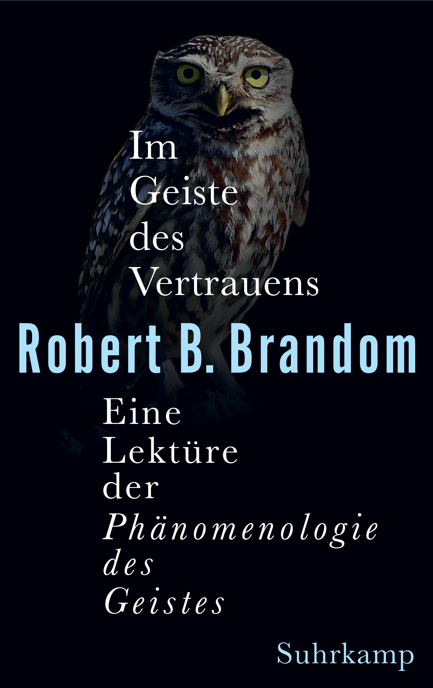
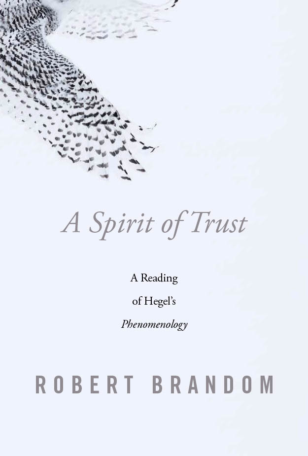
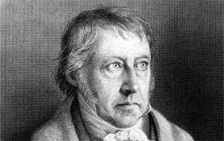
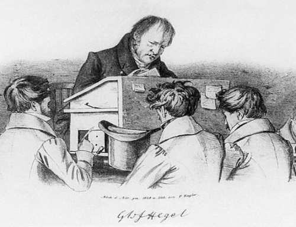
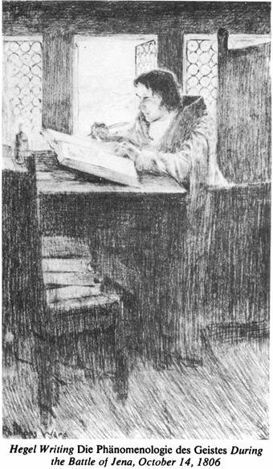
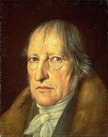
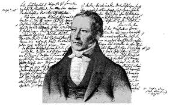
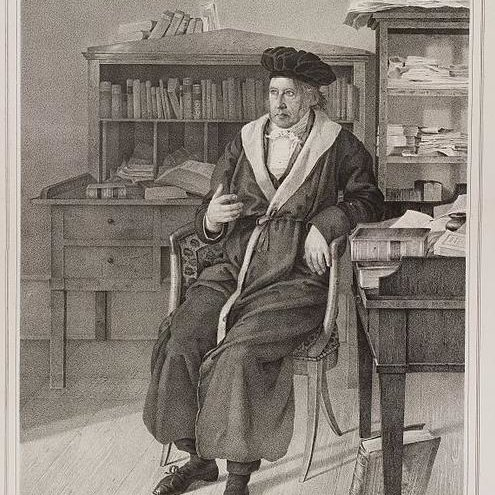
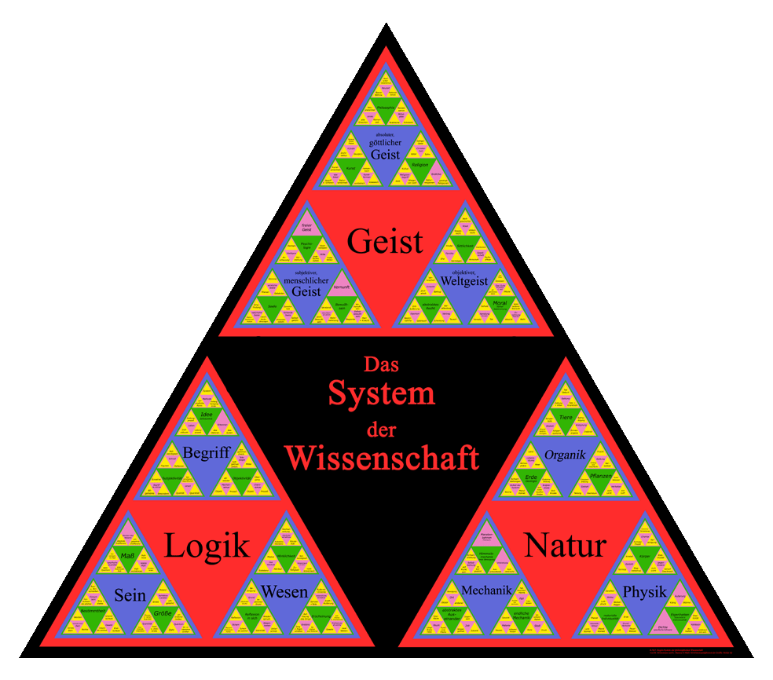

A Twentyfirst Century Semantic Recollection of Hegel's <em>Phenomenology of Spirit</em>

* * *

<a href="pdfs/Hegel_Syllabus_Fall_2021_21-8-15_a.pdf">Syllabus</a>

* * *

## Week 1. August 31, 2021

Introduction to the Course: Why Read Hegel Now? And How?

- [Read Brandom, "Hermeneutic Practices and Theories of Meaning" (2004).](pdfs/Hermeneutic_Practices_and_Theories_of_Meaning.pdf)
- [Read Marshall, "Implications of Brandom's Inferentialism for Intellectual History" (2013).](pdfs/Marshall_Implications_of_Inferentialism_for_Intellectual_History.pdf)
- [Read Harrelson, "Inferentialist Philosophy of Language and the Historiography of Philosophy" (2014).](pdfs/Inferentialism_and_Historiography_Harrelson.pdf)

##### Week 1 Materials

- [Brandom's Seminar Notes for Week 1](pdfs/Week_1_Notes_Mark_2_21-8-31_j.pdf)
- [Video of Seminar Meeting Week 1](https://youtu.be/va1sDoPRTAU)
- [Audio of Seminar Meeting Week 1](https://archive.org/download/brandom-hegel-seminar-2021-audio/Hegel_2021_Week_1_Audio.mp4)

##### Supplementary

- ["Untimely Review of the _Phenomenology_, in _Topoi_ (2008).](pdfs/Georg_Hegel_s_Phenomenology_of_Spirit.pdf)
- ["A Semantic Sonata in Kant and Hegel" Brandom's Columbia Woodbridge Lectures.](pdfs/Woodbridge_Lectures.pdf)

##### Video

- ["Self-Consciousness and Freedom in Kant and Hegel" Short informal talk at Pitt (April, 2021)](https://youtu.be/BdCc89CcQ10)
- [A Semantic Sonata in Kant and Hegel. Lecture 1: Norms, Selves, and Concepts (Pittsburgh 2008)](https://youtu.be/wDEPvBqKdZU)
- [A Semantic Sonata in Kant and Hegel. Lecture 2: Autonomy, Community, and Freedom (Pittsburgh 2008)](https://youtu.be/iNyQnviQlGs)
- [A Semantic Sonata in Kant and Hegel. Lecture 3: History, Reason, and Reality (Pittsburgh 2008)](https://youtu.be/pQkarDFcAZc)

##### Fun

[Images of Some Hermeneutic Styles](/courses/hegel-2021/hermeneutic-styles/)

* * *

## Week 2. September 7, 2021

Overview of a Pragmatist, Semantic Reading of the _Phenomenology_

- [Read _A Spirit of Trust_ Introduction.](pdfs/ST_Intro.pdf)
- [Read Brandom, Precis of _A Spirit of Trust_ ( _PPR_ forthcoming).](pdfs/Precis_of_A_Spirit_of_Trust_20-6-17_c.pdf)
- [Read Brandom, APA Author-Meets-Critics Precis of _A Spirit of Trust_.](pdfs/APA_Precis_of_A_Spirit_of_Trust_s.pdf)

##### Week 2 Materials

- [Handout for Week 2](pdfs/Week_2_Handout_21-9-7_f.pdf)
- [Brandom's Seminar Notes for Week 2](pdfs/Week_2_Notes_Mark_2_21-9-7_j.pdf)
- [Video of Seminar Meeting Week 2](https://youtu.be/cRibitd7_lo)
- [Audio of Seminar Meeting Week 2](https://archive.org/download/brandom-hegel-seminar-2021-audio/Hegel_2021_Week_2_Audio.mp4)

##### Supplementary

- ["A Hegelian Model of Legal Concept Determination: The Fine Structure of the Judges' Chain Novel(2013).](pdfs/A_Hegelian_Model_of_Legal_Concept_Determ.pdf)
- ["Heroism and Magnanimity" Aquinas Lecture (2019).](pdfs/Heroism_and_Magnanimity_PMFSCA_19-2-24_m.pdf)
- ["From German Idealism to American Pragmatism--and Back" from _Perspectives on Pragmatism_(2011).](pdfs/From_German_Idealism_to_American_Pragmat.pdf)

##### Video

- [APA Author Meets Critics Session on _A Spirit of Trust_ (January 2021)](https://youtu.be/G7czyWhIJLk)
- [A Hegelian Model of Legal Concept Determination (Amsterdam, 2021)](https://youtu.be/xZHOjHM-lVk)
- [Magnanimity and Agency in Hegel's _Phenomenology_ (Yale Francke lecture, 2018)](https://youtu.be/iy3BZXYpW50)
- [From German Idealism to American Pragmatism--and Back (Dublin, 2015)](https://www.youtube.com/watch?v=xe-QlUglr0g&t=62s)

* * *

## Week 3. September 14, 2021

Hegel's _Introduction_ to the _PG_. Critique of Representationalism and Sketch of an Alternate Approach

- [Read _Phenomenology_ Introduction.](pdfs/Dove_Translation_of_the_Introduction_to_the_Phenomenology.pdf)

  • Read _A Spirit of Trust_ Chapters 1, 2, 3

##### Week 3 Materials

- [Handout for Week 3](pdfs/Handout_for_Week_3_21-9-13_a.pdf)
- [Brandom's Seminar Notes for Week 3](pdfs/Week_3_Notes_Mark_2_21-9-14_e.pdf)
- [Video of Seminar Meeting Week 3](https://youtu.be/-Cq5RIumlwo)
- [Audio of Seminar Meeting Week 3](https://archive.org/download/brandom-hegel-seminar-2021-audio/Hegel_2021_Week_3_Audio.mp4)

##### Video

- [Humboldt Lecture 1: Conceptual Realism and the Semantic Possibility of Knowledge](https://youtu.be/eK6kmLIixnI)
- [Humboldt Lecture 2: Representation and the Experience of Error](https://youtu.be/vdpadZnoh_Q)
- [Humboldt Lecture 3: Following the Path of Despair to a Bacchanalian Revel](https://youtu.be/k-RFtwyx9Oo)

##### Supplementary Material

- ["Sketch of a Program for a Critical Reading of Hegel" from _Wiedererinnerter Idealismus_(2015).](pdfs/Sketch_of_a_Program.pdf)
- [Lecture text: Humboldt Lecture 1.](pdfs/KR1_CRSPK_11-5-29_a_rev_15-12-16_a.pdf)
- [Handout: Humboldt Lecture 1.](pdfs/KR1-CRSPK-Handout-a.pdf)
- [Lecture text: Humboldt Lecture 2.](pdfs/KR2-REE-11-5-31-b-rev-15-12-13-f.pdf)
- [Handout: Humboldt Lecture 2.](pdfs/KR2_REE_Handout_b_2015.pdf)
- [Lecture text: Humboldt Lecture 3.](pdfs/KR3_PDBR_11-6-1_a_rev_15-12-16_f.pdf)
- [Handout: Humboldt Lecture 3.](pdfs/KR3_FPDBR_Handout_b.pdf)

* * *

## Week 4. September 21, 2021

_Consciousness_ I: Two Varieties of Empiricism: Phenomenalist and Observational

 

• Read _Phenomenology_ Chapter 1: _Sense Certainty_

• Read _Phenomenology_ Chapter 2: _Perception_

• Read _A Spirit of Trust_ Chapters 4, 5

##### Week 4 Materials

- [Handout on the Structure of the _Phenomenology_ for Week 4](pdfs/Handout_on_Structure_of_the_Phenomenology_21-9-18_b.pdf)
- [Handout on _Sense Certainty_ chapter for Week 4](pdfs/Handout_1_for_Week_4_Sense_Certainty_21-9-18_b.pdf)
- [Handout on _Perception_ chapter for Week 4](pdfs/Handout_2_for_Week_4_Perception_21-9-18_d.pdf)
- [Brandom's Seminar Notes for Week 4](pdfs/Week_4_Notes_21-9-21_i.pdf)
- [Video of Seminar Meeting Week 4](https://youtu.be/mSeVpJDGzfE)
- [Audio of Seminar Meeting Week 4](https://archive.org/download/brandom-hegel-seminar-2021-audio/Hegel_2021_Week_4_Audio.mp4)

##### Video

- [Humboldt Lecture 4: Immediacy, Generality, and Recollection](https://youtu.be/hjFosQ4x1-0)
- ["An Introduction to Hegelian Logic and Metaphysics" (Edinburgh University Philosophy Society, 2021)](https://youtu.be/PcroynVFDjg)

##### Supplementary Material

- [Lecture text: Humboldt Lecture 4.](pdfs/4-IGR-16-6-28-e.pdf)
- [Handout: Humboldt Lecture 4.](pdfs/Handout-for-Lecture-4-IGR.pdf)
- [Lecture text: Humboldt Lecture 5.](pdfs/5-UOSTN-16-6-28-c.pdf)
- [Handout: Humboldt Lecture 5.](pdfs/Handout-for-Lecture-5-UOSTN.pdf)

* * *

## Week 5. September 28, 2021

_Consciousness_ II: Theoretical Entities and Conceptual Holism

 • Read _Phenomenology_ Chapter 3: _Force and Understanding_

 • Read _A Spirit of Trust_ Chapters 6, 7

##### Week 5 Materials

- [Handout for Week 5](pdfs/Week_5_Handout_21-9-28_d.pdf)
- [Brandom's Seminar Notes for Week 5](pdfs/Week_5_Notes_21-9-28_l.pdf)
- [Video of Seminar Meeting Week 5](https://youtu.be/QIPVd0Dfgsg)
- [Audio of Seminar Meeting Week 5](https://archive.org/download/brandom-hegel-seminar-2021-audio/Hegel_2021_Week_5_Audio.mp4)

##### Video

- [Humboldt Lecture 6: _Force and Understanding_--The Ontological Status of Theoretical Entities](https://youtu.be/2WIZ1iX9zq0)
- [Humboldt Lecture 7: Infinity, Conceptual Idealism and the Transition to _Self-Consciousness_](https://youtu.be/rJ4hxJ7ONF8)

##### Supplementary Material

- ["Holism and Idealism" (from _Tales of the Mighty Dead_, 2000)](pdfs/Holism_and_Idealism_in_Hegels_Phenomenology.pdf)
- ["Modal Expressivism and Modal Realism" (from _From Empiricism to Expressivism_, 2015)](pdfs/Modal_Expressivism_and_Modal_Realism_HUP.pdf)
- [Lecture text: Humboldt Lecture 6.](pdfs/6-FUFOC-16-6-29-g.pdf)
- [Handout: Humboldt Lecture 6.](pdfs/Handout-for-Lecture-6-FUFOC.pdf)
- [Lecture text: Humboldt Lecture 7.](pdfs/7-ICITSC-16-6-30-d.pdf)
- [Handout: Humboldt Lecture 7.](pdfs/Handout-for-Lecture-7-ICITSC.pdf)

##### Fun

[The Battle of Jena](images/Battle_of_Jena.jpg)

* * *

## Week 6. October 5, 2021

 _Self-Consciousness_ From Autonomy to Recognition

 • Read _Phenomenology_ Chapter 4

<em>The Independence and Dependence of Self-Consciousness: Lordship and Bondage</em>

 • Read _A Spirit of Trust_ Chapters 8, 9, 10

##### Week 6 Materials

- [Handout for Week 6](pdfs/Handout_for_Week_6_21-10-5_a.pdf)
- [Brandom's Seminar Notes for Week 6](pdfs/Week_6_Notes_Mark_2_21-10-5_g.pdf)
- [Video of Seminar Meeting Week 6](https://youtu.be/yqbZOAovjSc)
- [Audio of Seminar Meeting Week 6](https://archive.org/download/brandom-hegel-seminar-2021-audio/Hegel_2021_Week_6_Audio.mp4)

##### Video

- [Humboldt Lecture 8: The Structure of Desire and Recognition](https://youtu.be/EjyxKQ4Bt2U)
- [Humboldt Lecture 10: The Fine Structure of Autonomy and Recognition](https://youtu.be/jOCsQtMNPI8)
- [Humboldt Lecture 11: The Allegory of Mastery: Pragmatic and Semantic Lessons](https://youtu.be/a5eY71_WiHU)

##### Supplementary Material

- [Lecture text: Humboldt Lecture 8.](pdfs/8-SDR-lecture-17-5-30-c.pdf)
- [Handout: Humboldt Lecture 8.](pdfs/SDRHandout-orectic-w.pdf)
- [Lecture text: Humboldt Lecture 10](pdfs/10-FSAR-Lecture-Version-Abbreviated-17-6-1-c.pdf)
- [Handout: Humboldt Lecture 10.](pdfs/FSAR-Handout-h.pdf)
- [Lecture text: Humboldt Lecture 11](pdfs/11-TAM-Lecture-Version-Abbreviated-17-6-1-a.pdf)
- [Handout: Humboldt Lecture 11.](pdfs/TAM-Handout-f.pdf)

##### The **MISSING HISTORICAL CHAPTER**, left out of the final draft of _A Spirit of Trust_

- [PreHegelian Stages in the History of Normativity](pdfs/PreHegelian_Stages_in_the_History_of_Normativity.pdf)
- [Lecture text: Humboldt Lecture 9 (on the missing chapter).](pdfs/9-SAMR-Lecture-Version-17-6-25-a.pdf)
- [Handout: Humboldt Lecture 9.](pdfs/SAMR-Handout-f.pdf)

##### Diverting Detail

[Alexandre Kojève](pdfs/Alexandre_Kojeve_Pics_3.pdf)

* * *

## Week 7. October 12, 2021

_Reason_: Practical Agency

• Read _Phenomenology_ Chapter 5 B: _The Actualization of Rational Self-Consciousness through its own Activity_

 • Read _Phenomenology_ Chapter 5 C: _Individuality which Takes Itself to be Real In and For Itself_

 • Read _A Spirit of Trust_ Chapters 11, 12

##### Week 7 Materials

- [Handout for Week 7](pdfs/Week_7_Handout_21-10-12_a.pdf)
- [Brandom's Seminar Notes for Week 7](pdfs/Week_7_Notes_Mark_2_21-10-12_j.pdf)
- [Video of Seminar Meeting Week 7](https://youtu.be/xuuuxd1Q5Iw)
- [Audio of Seminar Meeting Week 7](https://archive.org/download/brandom-hegel-seminar-2021-audio/Hegel_2021_Week_7_Audio.mp4)

##### Video

- [Humboldt Lecture 12: Some Post-Davidsonian Elements of Hegel’s Theory of Agency](https://youtu.be/Tkyi61z3-1c)
- [Humboldt Lecture 13: Agency, Intention, and the Expressive Determination of Content](https://youtu.be/fD6MqP5e2LY)

##### Supplementary Material

- [Lecture text: Humboldt Lecture 12.](pdfs/12-HEMA-Lecture-I-SPDEHTA-18-6-4-b.pdf)
- [Handout: Humboldt Lecture 12.](pdfs/HEMA-Lecture-I-SPDEHTA-Handout-h.pdf)
- [Lecture text: Humboldt Lecture 13.](pdfs/13-HEMA-Lecture-II-AIEDC-18-6-8-c.pdf)
- [Handout: Humboldt Lecture 13.](pdfs/HEMA-Lecture-II-AIEDC-Handout-g.pdf)

* * *

**No Class October 19, 2021**

* * *

## Week 8. October 26, 2021

 From Traditional to Modern _Geist_

 

 • Read _Phenomenology_ Chapter 6 A: _The True Spirit. The Sittlich Order._

 • Read _A Spirit of Trust_ Chapter 13

##### Week 8 Materials

- [Handout for Week 8](pdfs/Week_8_Spirit_I_Handout_c.pdf)
- [Brandom's Seminar Notes for Week 8](pdfs/Week_8_notes_21-10-26_i.pdf)
- [Video of Seminar Meeting Week 8](https://youtu.be/1_vNShJacHU)
- [Audio of Seminar Meeting Week 8](https://archive.org/download/brandom-hegel-seminar-2021-audio/Hegel_2021_Week_8_Audio.mp4)

##### Video

[Humboldt Lecture 15.   Epochs of Geist: Traditional Normativity as Immediate Sittlichkeit](https://youtu.be/e9cZPSSqr7A)

##### Supplementary Material

- [Lecture text: Humboldt Lecture 15.](pdfs/15-Epochs-of-Geist-19-5-19-a.pdf)
- [Handout: Humboldt Lecture 15.](pdfs/Epochs-of-Geist-Handout-c.pdf)
- [Sophocles' _Antigone_. Paul Woodruff translation.](pdfs/Sophocles_Antigone-Woodruff.pdf)

* * *

## Week 9. November 2, 2021

 Language, Alienation, and Modern _Geist_

 • Read _Phenomenology_ Chapter 6 B: _Self-Alienated Spirit. Culture_

 • Read _A Spirit of Trust_ Chapter 14

##### Week 9 Materials

- [Handout for Week 9](pdfs/Week_9_Handout_Modernity_Alienation_and_Language_c.pdf)
- [Brandom's Seminar Notes for Week 9](pdfs/Week_9_Notes_21-11-2_j.pdf)
- [Video of Seminar Meeting Week 9](https://youtu.be/IQMEOyq3FqQ)
- [Audio of Seminar Meeting Week 9](https://archive.org/download/brandom-hegel-seminar-2021-audio/Hegel_2021_Week_9_Audio.mp4)

##### Video

- [Humboldt Lecture 16: Modernity, Alienation, and Language](https://youtu.be/YQicht2HvLw)
- [Reason, Genealogy, and the Hermeneutics of Magnanimity--Townsend Lecture, Berkeley (2013)](https://youtu.be/KNB65BY-ZPE)

##### Supplementary Material

- [Lecture text: Humboldt Lecture 16.](pdfs/16-Modernity-and-Language-19-5-19-a.pdf)
- [Handout: Humboldt Lecture 16.](pdfs/Modernity-Alienation-and-Language-Handout-b.pdf)

* * *

## Week 10. November 9, 2021

 Transition to Post-Modernity: Confession, Forgiveness, and Trust

 

 • Read _Phenomenology_ Chapter 6 C: _Spirit that is Certain of Itself. Morality._

 • Read _A Spirit of Trust_ Chapter 15, 16

##### Week 10 Materials

- [Handout for Week 10](pdfs/Handout_for_Week_10_Genealogy_and_Magnanimity_Confession_and_Forgiveness_e.pdf)
- [Brandom's Seminar Notes for Week 10](pdfs/Week_10_Notes_21-11-9_j.pdf)
- [Video of Seminar Meeting Week 10](https://youtu.be/8aBL9AHywqI)
- [Audio of Seminar Meeting Week 10](https://archive.org/download/brandom-hegel-seminar-2021-audio/Hegel_2021_Week_10_Audio.mp4)

##### Video

- [Magnanimity and Agency. Francke Lecture, Yale (2018).](https://youtu.be/iy3BZXYpW50)
- [Humboldt Lecture 17: Genealogy and Magnanimity: The Allegory of the Valet](https://youtu.be/LKKfBA8JuH0)
- [Humboldt Lecture 18: Confession and Forgiveness, Recollection and Trust](https://youtu.be/A9jZ9htC76w)

##### Supplementary Material

- [Heroism and Magnanimity--Aquinas Lecture, Marquette (2018).](pdfs/Heroism_and_Magnanimity_Long_Version_18-10-9_l.pdf)
- [Lecture text: Humboldt Lecture 17.](pdfs/17-Genealogy-and-Magnanimity-19-6-4-a.pdf)
- [Handout: Humboldt Lecture 17.](pdfs/Genealogy-and-Magnanimity-Handout-a.pdf)
- [Lecture text: Humboldt Lecture 18.](pdfs/18-Confession-and-Forgiveness-Recollection-and-Trust-19-5-19-a.pdf)
- [Handout: Humboldt Lecture 18.](pdfs/Confession-and-Forgiveness-Recollection-and-Trust-Handout-b.pdf)

* * *

## Week 11. November 16, 2021

 Substance as Subject and Absolute Knowing

 • Read _Phenomenology_ _Preface_

 • Read _Phenomenology_ Chapter 8: _Absolute Knowing_

[Read _A Spirit of Trust_ Conclusion.](pdfs/ST_Conclusion.pdf)

##### Week 11 Materials

- [Handout for Week 11: Passages from _Absolute Knowing_ and _Preface_](pdfs/Week_11_Handout_d.pdf)
- [Brandom's Seminar Notes for Week 11](pdfs/Week_11_Notes_v2_21-11-16_j.pdf)
- [Video of Seminar Meeting Week 11](https://youtu.be/MEpT3Kx_C3c)
- [Audio of Seminar Meeting Week 11](https://archive.org/download/brandom-hegel-seminar-2021-audio/Hegel_2021_Week_11_Audio.mp4)

* * *

**No Class November 23, 2021:**

##### Thanksgiving Holiday Break

* * *

## Week 12. November 30, 2021

##### From the _Phenomenology_ to the _Science of Logic_

 

- [Read _The Science of Logic_: _Begriffslogik_. The Idea.](pdfs/SL_Notion_Idea.pdf)
- [Read _A Spirit of Trust_ Conclusion.](pdfs/ST_Conclusion.pdf)

##### Week 12 Materials

- [Handout for Week 12: Passages from _Preface_ and _Science of Logic_](pdfs/Week_12_Handout_e.pdf)
- [Brandom's Seminar Notes for Week 12](pdfs/Week_12_Notes_Mark_2_for_distribution_21-11-30_u.pdf)
- [Video of Seminar Meeting Week 12](https://youtu.be/17rRcue3lVY)
- [Audio of Seminar Meeting Week 12](https://archive.org/download/brandom-hegel-seminar-2021-audio/Hegel_2021_Week_12_Audio.mp4)

* * *

## Week 13. December 7, 2021

##### Conclusion: Hegel in the Twentyfirst Century

[Read _A Spirit of Trust_ Conclusion.](pdfs/ST_Conclusion.pdf)

##### Week 13 Materials

- [Handout for Week 13: Passages from the _Science of Logic_](pdfs/Week_13_Handout_e.pdf)
- [Brandom's Seminar Notes for Week 13](pdfs/Week_13_Notes_21-12-7_h.pdf)
- [Video of Seminar Meeting Week 13](https://youtu.be/c3AdAz1Z8wY)
- [Audio of Seminar Meeting Week 13](https://archive.org/download/brandom-hegel-seminar-2021-audio/Hegel_2021_Week_13_Audio.mp4)

* * *

##### Some Further Resources

- [Course website for Brandom's 2017 seminar on Hegel's _Phenomenology_, with audio of all sessions.](https://spaceofreasons.netlify.app/courses/hegel-phenomenology-2017/)
- [Some Hegel links to texts](pdfs/Some_Hegel_links_21-11-3_a.pdf)
- [Thomas Carlyle's _Sartor Resartus_](pdfs/Sartor-Resartus.pdf)
- [Video of All 18 Humboldt Lectures At Once (!)](https://www.youtube.com/watch?v=p8i8ANmQqlg)
