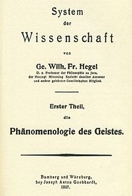

***

<a href="pdfs/Hegel_Seminar_Syllabus_2017.pdf">Syllabus</a>

***

## Week 1: Introduction

##### Week 1 Materials

- [Handout for Week 1](pdfs/1_Hegel_Week_One_Handout_17-8-29_a.pdf)
- [Notes for Week 1](pdfs/1_Introduction_of_ASoT_notes_17-8-30_j.pdf)
- [Audio for Week 1](https://archive.org/download/brandom-hegel-seminar-2017/Brandom-Hegel-Fall-2017-Session-1.mp3)

***

## Week 2: Hegel's Introduction

##### Week 2 Materials

- [Handout for Week 2](pdfs/2_Hegels_Introduction_Handout_17-9-6_d.pdf)
- [Notes for Week 2](pdfs/2_Week_2_Notes_17-9-6_d.pdf)
- [Audio for Week 2](https://archive.org/download/brandom-hegel-seminar-2017/Brandom-Hegel-Fall-2017-Session-2.mp3)

***

## Week 3: Sense Certainty

##### Week 3 Materials

- [Handout for Week 3](pdfs/3_Handout_for_Sense_Certainty_17-9-13_a.pdf)
- [Notes for Week 3](pdfs/3_SC_notes_17-9-13_j.pdf)
- [Audio for Week 3](https://archive.org/download/brandom-hegel-seminar-2017/Brandom-Hegel-Fall-2017-Session-3.mp3)

***

## Week 4: Perception

##### Week 4 Materials

- [Handout for Week 4](pdfs/4_Handout_for_Week_4_Perception_17-9-20_c.pdf)
- [Notes for Week 4](pdfs/4_Perception_Notes_17-9-20_c.pdf)
- [Audio for Week 4](https://archive.org/download/brandom-hegel-seminar-2017/Brandom-Hegel-Fall-2017-Session-4.mp3)

***

## Week 5: Force and Understanding

##### Week 5 Materials

- [Handout for Week 5](pdfs/5_FU_Handout_17-10-4_d.pdf)
- [Notes for Week 5](pdfs/5_FU_Notes_17-10-4_b.pdf)
- [Audio for Week 5](https://archive.org/download/brandom-hegel-seminar-2017/Brandom-Hegel-Fall-2017-Session-5.mp3)

***

## Week 6: Self-Consciousness I

##### Week 6 Materials

- [Handout for Week 6](pdfs/6_Handout_for_Self-Consciousness_I_17-10-11_i.pdf)
- [Notes for Week 6](pdfs/6_SC_Notes_17-10-11_j.pdf)
- [Audio for Week 6](https://archive.org/download/brandom-hegel-seminar-2017/Brandom-Hegel-Fall-2017-Session-6.mp3)

***

## Week 7: Self-Consciousness II

##### Week 7 Materials

- [Handout for Week 7](pdfs/7_Week_7_Handout_b.pdf)
- [Notes for Week 7](pdfs/7_Week_7_Notes_17-10-18_e.pdf)
- [Audio for Week 7](https://archive.org/download/brandom-hegel-seminar-2017/Brandom-Hegel-Fall-2017-Session-7.mp3)

***

## Week 8: Reason I

##### Week 8 Materials

- [Handout for Week 8](pdfs/8_Reason_I_Handout_17-10-25_e.pdf)
- [Notes for Week 8](pdfs/8_Reason_I_Notes_17-10-25_d.pdf)
- [Audio for Week 8](https://archive.org/download/brandom-hegel-seminar-2017/Brandom-Hegel-Fall-2017-Session-8.mp3)

***

## Week 9: Reason II

##### Week 9 Materials

- [Notes for Week 9](pdfs/9_Week_9_notes_with_2013_17-11-3_a.pdf)
- [Audio for Week 9](https://archive.org/download/brandom-hegel-seminar-2017/Brandom-Hegel-Fall-2017-Session-9.mp3)

***

## Week 10: Spirit I

##### Week 10 Materials

- [Handout for Week 10](pdfs/10_Week_10_Spirit_I_2017_Handout_e.pdf)
- [Notes for Week 10](pdfs/10_Week_10_Spirit_I_Notes_2017_17-11-9_b.pdf)
- [Audio for Week 10](https://archive.org/download/brandom-hegel-seminar-2017/Brandom-Hegel-Fall-2017-Session-10.mp3)

***

## Week 11: Spirit II

##### Week 11 Materials

- [Handout for Week 11](pdfs/11_Handout_for_Spirit_II_Week_11_17-11-15_e.pdf)
- [Notes for Week 11](pdfs/11_Week_11_notes_13-11-20_b_reve_17-11-15_b.pdf)
- [Audio for Week 11](https://archive.org/download/brandom-hegel-seminar-2017/Brandom-Hegel-Fall-2017-Session-11.mp3)

***

## Week 12: Conclusion I

##### Week 12 Materials

- [Handout for Week 12](pdfs/12_Week_12_Handout_b.pdf)
- [Notes for Week 12](pdfs/12_Week_12_Notes_17-11-29_f.pdf)
- [Audio for Week 12](https://archive.org/download/brandom-hegel-seminar-2017/Brandom-Hegel-Fall-2017-Session-12.mp3)

***

## Week 13: Conclusion II

##### Week 13 Materials

- [Handout for Week 13](pdfs/13_Week_13_Handout_Preface_passages_a.pdf)
- [Notes for Week 13](pdfs/13_Week_13_Notes_17-12-6_d.pdf)
- [Audio for Week 13](https://archive.org/download/brandom-hegel-seminar-2017/Brandom-Hegel-Fall-2017-Session-13.mp3)

***

## Additional Resources

- [18 Hegel lectures from *A Spirit of Trust*](pdfs/A_Pragmatist_Semantic_Reading_of_Hegel_20-5-26_t.pdf)
- [Video and Audio](https://sites.pitt.edu/~rbrandom/Video%20Mark%203%20d.html)
