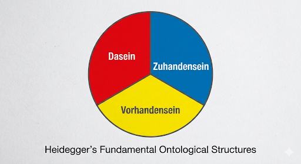
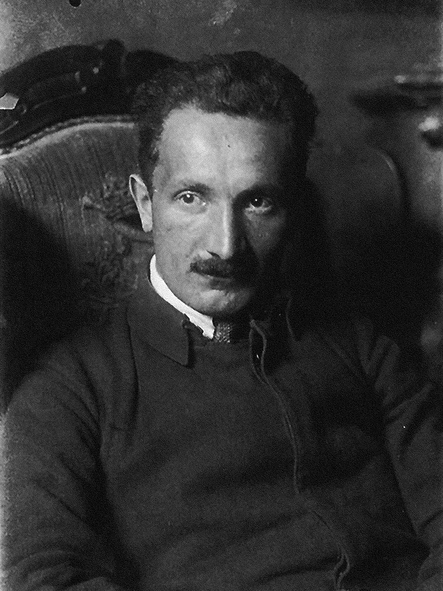
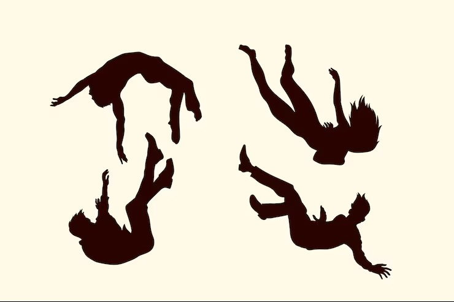
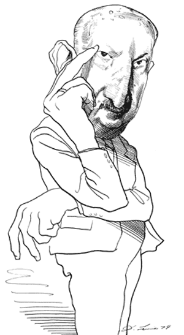
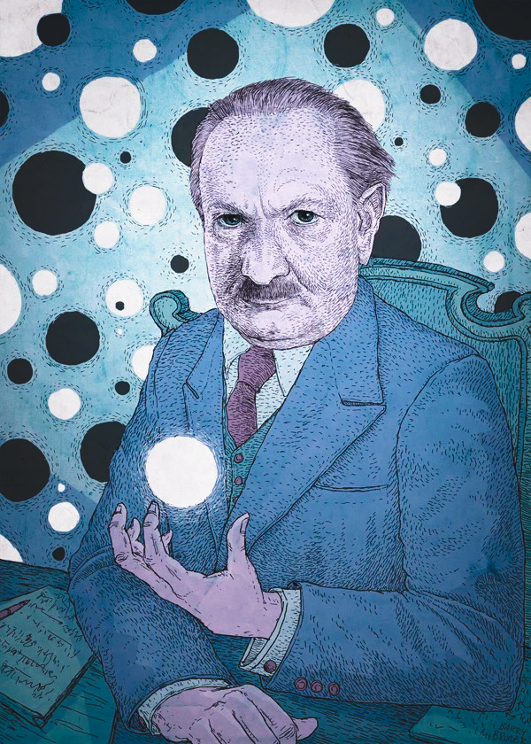

<strong>Heidegger, Being, and the World</strong>

  Bob Brandom--Fall 2026   
  

###  
 Wednesdays at 1pm in 1008 B, Cathedral of Learning 
  

 
   
  

<strong> So Much Being, So Little Time</strong>
 

* * *

<strong> Some Basic Resources</strong>
 

- [Heidegger: _Being and Time_ (English)](pdfs/BT.pdf)
- [Heidegger: _Sein und Zeit_ (German)](pdfs/Heidegger_Sein_und_Zeit.pdf)
- [Hubert Dreyfus: _Being-in-the-World_ ](pdfs/hubert-dreyfus-being-in-the-world.pdf)
- [John Haugeland (Joseph Rouse editor) _Dasein Disclosed_](pdfs/Dasein_Disclosed_-_John_Haugeland.pdf)
- [Haugeland's Glossary for _Being and Time_](pdfs/Haugelands_Glossary.pdf)
- [William Blattner _Heidegger's Being and Time_](pdfs/Heideggers+Being+and+Time+Blattner.pdf)
- [Blattner's Glossary](pdfs/Blattner_Glossary.pdf)
- [Mark Okrent _Heidegger's Pragmatism_ (1988)](pdfs/Okrent_Heideggers_Pragmatism.pdf)
- [Brandom, "Heidegger's Categories in _Being and Time_ (1983)](pdfs/Brandom_HCBT.pdf)
- [Catalogue of Heidegger's _Gesamtausgabe_](https://heideggerswritings.org/ga/) 

* * *

<strong> Three Generations of Analytic Pragmatist Heideggerians: </strong>
 

<strong>  Dreyfus, Haugeland, Blattner</strong>
 

    
    
    

* * *
## Week 1. August 26, 2026: Introduction

The Ontological Difference.

Heidegger's Tripartite Ontology: Dasein, Vorhandensein, Zuhandensein

The Contours of Heidegger's Corpus

   
  

#### Week 1 Materials

- [Handout for Week 1](pdfs/Week_1_Handout_26_8_23_a.pdf)  
- [Presentation Notes for Week 1](pdfs/Week_1_Presentation_notes_a.pdf)
 - [Video of Week 1](https://pitt.hosted.panopto.com/Panopto/Pages/Viewer.aspx?id=a66d6129-f89f-476e-8b04-b4b300fd51ce) 
 - [Audio of Week 1](https://pitt.hosted.panopto.com/Panopto/Pages/Viewer.aspx?id=ff09db4f-94ff-4ac8-82c4-b4b30143c55f)  

##### Supplementary
- [Brandom, Rorty on Vocabularies](pdfs/Rorty_on_vocabularies.pdf) 
* * *

<strong>Part One</strong>

<strong>Being and Time (1927)</strong>

* * *

## Week 2. September 2, 2026: Being

Heidegger's Introduction: The Question of Being, and Phenomenological Method

- [Read Heidegger, _Being and Time_ (1927) §§1-8 = MR pp. 21-64.](pdfs/BT.pdf)

- [Read Gilbert Ryle's review of Heidegger's _Being and Time_ ](pdfs/Ryle_review.pdf)

#### Week 2 Materials

- [Passages from _Being and Time_ §§1-8](pdfs/Passages-from-Being-and-Time-1-8.pdf) 
<!--- - [Presentation Notes for Week 2]()
- [Video of Week 2]()
- [Audio of Week 2]() -->

##### Supplementary
- [Dreyfus, _Being-in-the-World_, Chapters 1 and 2, pp. 10-39.](pdfs/hubert-dreyfus-being-in-the-world.pdf)
- [Haugeland, _Dasein Disclosed_, Chapters 1 and 2, pp. 51-75.](pdfs/Dasein_Disclosed_-_John_Haugeland.pdf)
- [Brandom, _A Spirit of Trust_, Chapter 12, pp. 422-442, on phenomena/noumena and sense/reference in Hegel](pdfs/ST_Ch_12.pdf) 

* * *

## Week 3. September 9, 2026: Dasein

Dasein.  
Fundamental Ontology is the Regional Ontology (Existential Analysis) of Dasein.

- [Read Heidegger, _Being and Time_ (1927) §9, §§12-15 = MR pp. 65-71, 78-102.).](pdfs/BT.pdf)

#### Week 3 Materials

- [Passages from _Being and Time_ §§9-15](pdfs/Passages_from_Being_and_Time_sections_9-15.pdf) 
<!---- [Handout for Week 3]()
- [Presentation Notes for Week 3]()
- [Video of Week 3]()
- [Audio of Week 3]() -->

##### Supplementary

- [Dreyfus, _Being-in-the-World_, Chapters 3, pp. 40-59.](pdfs/hubert-dreyfus-being-in-the-world.pdf)
- [Haugeland, _Dasein Disclosed_, Chapter 3, pp. 76-90.](pdfs/Dasein_Disclosed_-_John_Haugeland.pdf)
- [Haugeland, "Dasein's Disclosedness, pp. 17-39.](pdfs/Dasein_Disclosed_-_John_Haugeland.pdf)

* * *

## Week 4. September 16, 2026: Zuhandensein

Zuhandensein: Availability or Readiness-to-Hand

The World as an Equipmental Totality of Functional Affordances

<strong> To the man who only has a hammer, the whole world looks like a nail.</strong>
 

- [Read Heidegger, _Being and Time_ (1927) §§16-18 = MR pp. 102-123](pdfs/BT.pdf)

#### Week 4 Materials

- [Passages from _Being and Time_ §§16-18](pdfs/Passages_16-18.pdf) 
<!---- - [Handout for Week 4]()
- [Presentation Notes for Week 4]()
- [Video of Week 4]()
- [Audio of Week 4]() -->

##### Supplementary
- [Dreyfus, _Being-in-the-World_, Chapters 4, pp. 60-87.](pdfs/hubert-dreyfus-being-in-the-world.pdf)
- [Haugeland, _Dasein Disclosed_, Chapter 4, pp. 91-120.](pdfs/Dasein_Disclosed_-_John_Haugeland.pdf)
- [Brandom,"Heidegger's Categories in _Being and Time_"](pdfs/Brandom_HCBT.pdf)

* * *

## Week 5. September 23, 2026: Mitsein and das Man

The Social Dimension of Dasein

- [Read Heidegger, _Being and Time_ (1927) §§21-23, §§25-30 = MR pp. 125-135, 149-179](pdfs/BT.pdf)

#### Week 5 Materials

<!----- [Handout for Week 5]()
- [Presentation Notes for Week 5]()
- [Video of Week 5]()
- [Audio of Week 5]() -->

##### Supplementary
- [Dreyfus, _Being-in-the-World_, Chapters 5, pp. 88-107, Chapter 8, pp. 141-162.](pdfs/hubert-dreyfus-being-in-the-world.pdf)
- [Haugeland, _Dasein Disclosed_, Chapters 6 and 7, pp. 121-151.](pdfs/Dasein_Disclosed_-_John_Haugeland.pdf)

* * *

## Week 6. September 30, 2026: Presence (Vorhandenheit)

Understanding and Language

- [Read Heidegger, _Being and Time_ (1927) §§31-34 = MR pp. 182-203](pdfs/BT.pdf)
- [Read Brandom, "Dasein, the Being that Thematizes" (2003).](pdfs/Brandom_DBT.pdf)

#### Week 6 Materials

 <!---- - [Handout for Week 6]()
- [Presentation Notes for Week 6]()
- [Video of Week 6]()
- [Audio of Week 6]() -->

##### Supplementary
- [Dreyfus, _Being-in-the-World_, Chapters 9-12, pp. 163-224.](pdfs/hubert-dreyfus-being-in-the-world.pdf)
- [Haugeland, "Reading Brandom Reading Heidegger" (2005), pp. 157-166.](pdfs/Dasein_Disclosed_-_John_Haugeland.pdf)
- [Haugeland, "Letting Be" (2007), pp. 167-178.](pdfs/Dasein_Disclosed_-_John_Haugeland.pdf)

* * *

## Week 7. October 7, 2026: Falling

Falling

- [Read Heidegger, _Being and Time_ (1927) §§35-38 = MR pp. 210-224](pdfs/BT.pdf)

#### Week 7 Materials

<!---- - [Handout for Week 7]()
- [Presentation Notes for Week 7]()
- [Video of Week 7]()
- [Audio of Week 7]() -->

##### Supplementary
- [Dreyfus, _Being-in-the-World_, Chapter 13, pp. 225-237.](pdfs/hubert-dreyfus-being-in-the-world.pdf)

## Week 8. October 14, 2026:  Care as the Being of Dasein I

Care as the Being of Dasein I

- [Read Heidegger, _Being and Time_ (1927) §§39-42 = MR pp. 225-244](pdfs/BT.pdf)

#### Week 8 Materials

<!---- - [Handout for Week 8]()
- [Presentation Notes for Week 8]()
- [Video of Week 8]()
- [Audio of Week 8]() -->

##### Supplementary
- [Dreyfus, _Being-in-the-World_, Chapter 14, pp. 238-245.](pdfs/hubert-dreyfus-being-in-the-world.pdf)

* * *

## Week 9. October 21, 2026:  Care as the Being of Dasein II

Care as the Being of Dasein II

- [Read Heidegger, _Being and Time_ (1927) §§43-44 = MR pp. 245-273](pdfs/BT.pdf)

#### Week 9 Materials

<!---- - [Handout for Week 9]()
- [Presentation Notes for Week 9]()
- [Video of Week 9]()
- [Audio of Week 9]() -->

##### Supplementary

* * *

## Week 10. October 28, 2026 Division Two of _Being and Time_

Division Two of _Being and Time_

- [Read Heidegger, _Being and Time_ (1927) §45, §60, §65, §§67-69, §72, §74](pdfs/BT.pdf)

#### Week 10 Materials

<!---- - [Handout for Week 10]()
- [Presentation Notes for Week 10]()
- [Video of Week 10]()
- [Audio of Week 10]() -->

##### Supplementary
- [Dreyfus, _Being-in-the-World_, Appendix on Late Work, pp. 283-340.](pdfs/hubert-dreyfus-being-in-the-world.pdf)
- [Haugeland, "Truth and Finitude: Heidegger's Transcendental Existentialism" (2000), pp. 187-220.](pdfs/Dasein_Disclosed_-_John_Haugeland.pdf)
- [Haugeland, "Death and Dasein" (2007), pp. 179-186.](pdfs/Dasein_Disclosed_-_John_Haugeland.pdf)

* * *

* * *

<strong>Part Two</strong>

<strong>Post-<i>Kehre<i> and Late Work   </strong>

* * *

## Week 11. November 4, 2026:  Late Stuff I.   The _Beiträge_

Heidegger's _Kehre_

<strong> The unspeakable contemplating the unsayable.</strong>
 

- [Read Heidegger, _Contributions to Philosophy (Ereignis)_  Selections](pdfs/Beitrage.pdf)

#### Week 11 Materials

<!---- - [Handout for Week 11]()
- [Presentation Notes for Week 11]()
- [Video of Week 11]()
- [Audio of Week 11]() -->

##### Supplementary

- [Simon Blackburn, "Enquivering" (2000)](pdfs/Blackburn_Enquivering.pdf)

* * *

## Week 12. November 11, 2026:  Late Stuff II. The Fourfold (Das Geviert)

 Das Geviert:

 Earth and Sky, 
 
 Mortals and Divinities

- [Read Heidegger, “Building, Dwelling, Thinking” (2003).](pdfs/)

#### Week 12 Materials

<!---- - [Handout for Week 12]()
- [Week 12 Plan]()
- [Presentation Notes for Week 12]()
- [Video of Week 12]()
- [Audio of Week 12]() -->

##### Supplementary
- [Andrew Mitchell, _The Fourfold_: Introduction](pdfs/Mitchell_The_Fourfold.pdf)
- [Charles Spinosa, "Heidegger on Living Gods"](pdfs/Spinosa_Heidegger_on_Living_Gods.pdf)

* * *

## Week 13. November 18, 2026:  Late Stuff III. Things in the World

 Things in the World

    
    
    

- [Read Heidegger, “The Thing”](pdfs/)

#### Week 13 Materials

<!---- - [Handout for Week 13]()
- [Presentation Notes for Week 13]()
- [Video of Week 13]()
- [Audio of Week 13]() -->

#### Some Further Famous Late Essays
- ["The Origin of the Work of Art" (1935)](pdfs/Origin_of_the_Work_of_Art.pdf)
- ["Letter on Humanism" (1947)](pdfs/Letter_on_Humanism.pdf)
- ["The Question Concerning Technology" (1953)](pdfs/The_Question_Concerning-Technology.pdf)

* * *

## Week 14. December 2, 2026: Conclusion

Shepherding Being

#### Week 14 Materials

<!---- - [Handout for Week 14]()
- [Presentation Notes for Week 14]()
- [Video of Week 14]()
- [Audio of Week 14]() -->

##### Supplementary

* * *

## Some Further Resources

-Re Nazi Politics 1933-34:
- [Heidegger's Political Tracts 1933-34](pdfs/Heidegger_Political_Tracts_1933-34.pdf)
- [The Rektoratsrede (1933)](pdfs/rectors-address.pdf)
- [Rorty, "Heidegger's Nazism: An Alternative View"](pdfs/Rorty_Heideggers_Nazism--An_Alternative_History.pdf)
- [Der Spiegel Interview with Heidegger (1966)](pdfs/Der-Spiegel-Interview-with-Martin-Heidegger-1966.pdf) 
- [Günter Grass, _Dog Years_ (1963) Excerpts](pdfs/Dog_Years_Gunter_Grass_excerpts.pdf) 

-Some early stuff we won't discuss:

- [Heidegger's Habilitationsschrift "Duns Scotus's Doctrine of Categories and Meaning"(1915)](pdfs/duns_scotus_heidegger.pdf) 
- [David Marshall, The Weimar Origins of Rhetorical Inquiry (2020)--Heidegger Chapter](pdfs/Marshall_weimar_origins_Heidegger_chapter.pdf) 

