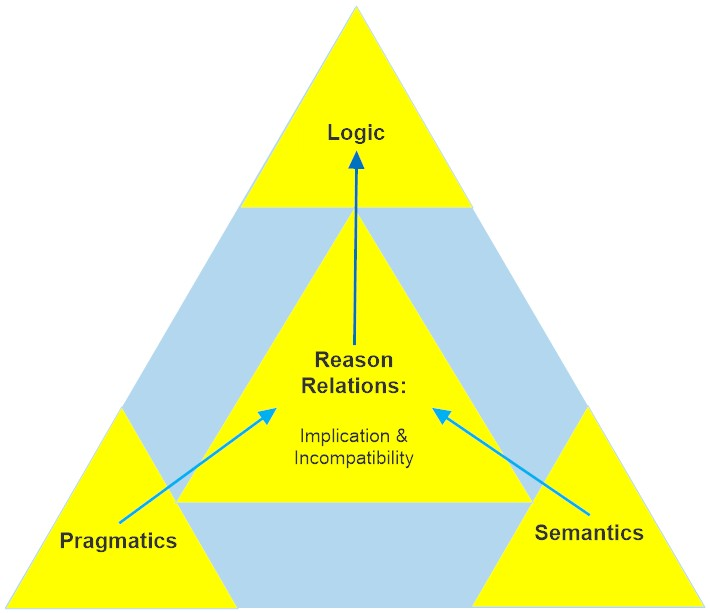
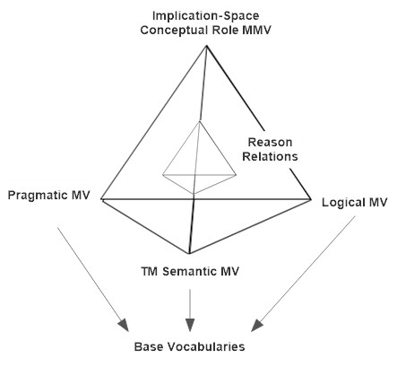
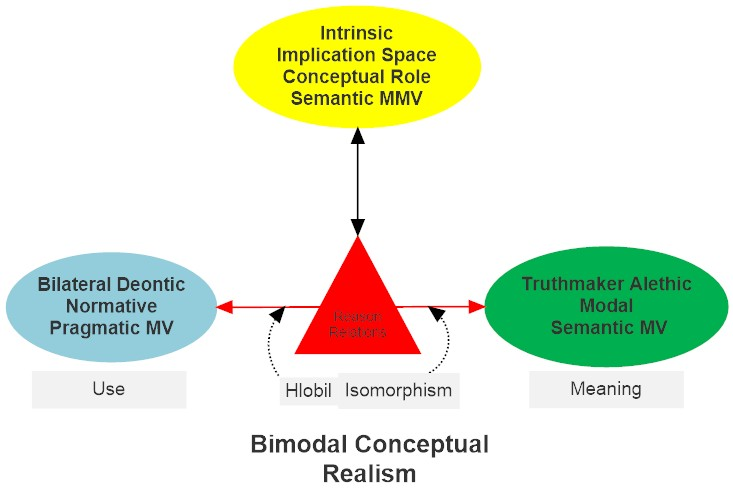

---

## Week 1. **August 31, 2022:**

Introduction to the Course

A Metarationalist Perspective on Language, Logic, and Meaning

- [Read Brandom, _Articulating Reasons_ Introduction, pp. 1-35.](pdfs/Brandom_Articulating_Reasons.pdf)
- [Read Brandom, "Intentionality and Language: A Normative, Pragmatist, Inferentialist Approach".](pdfs/Intentionality_and_Language_A_Normative.pdf)

##### Week 1 Materials

- [Handout for Meeting 1: Introduction](pdfs/Handout_for_Week_1_22-8-30_j.pdf)
- [Brandom's notes for Meeting 1: Introduction](pdfs/Course_Intro_Notes_22-8-31_d.pdf)
- [Video of Meeting 1: Introduction](https://youtu.be/e7CLfxd2v6Q)
- [Audio of Meeting 1: Introduction](https://pitt.hosted.panopto.com/Panopto/Pages/Viewer.aspx?id=77043418-9eda-430f-8a1d-af0300004bf6)

##### Supplementary

- [Brandom "Asserting".](pdfs/Asserting.pdf)
- [Brandom "On the Structure of Reasons: Pragmatics, Semantics, and Logic".](pdfs/OSRPSL_21-8-9_d.pdf)

## Week 2. **September 7, 2022:**

Pragmatics I

The 'Vocabulary' Vocabulary, and

Normative Pragmatic Metavocabularies for Autonomous Discursive Practices

- [Read Brandom, _Making It Explicit_, Chapter One.](pdfs/Brandom_MIE_Part_One.pdf)
- [Read Brandom, _Articulating Reasons_, Chapter Six, pp. 185-196.](pdfs/Brandom_Articulating_Reasons.pdf)

##### Week 2 Materials

- [Handout for Meeting 2: Pragmatics I](pdfs/Handout_for_Week_2_22-9-6_j.pdf)
-[Brandom's notes for Meeting 2: Pragmatics I](pdfs/Pragmatics_I_notes_22-9-7_g.pdf)
- [Video of Meeting 2: Pragmatics I](https://youtu.be/Rszr9jy3Yf4)
- [Audio of Meeting 2: Pragmatics I](https://pitt.hosted.panopto.com/Panopto/Pages/Viewer.aspx?id=0db26cd2-575d-44ba-abfc-af090171321d)
- [Pragmatic Metavocabulary Meaning-Use Diagram](pdfs/Pragmatic_MV_Diagram.pdf)

##### Supplementary

- [Hlobil "Anti-Normativism Evaluated"](pdfs/Hlobil_on_AntiNormativism.pdf)
- [Ginsborg "Normativity and Concepts"](pdfs/Ginsborg_on_Normativity_and_Concepts.pdf)

## Week 3. **September 14, 2022:**

Pragmatics II

A Deepened Normative Bilateralism and Reason Relations

- [Read _Reasons for Logic, Logic for Reasons_ Chapter 1 (draft).](pdfs/Brandom_RLLR_Ch_1_22-8-14_a.pdf)
- [Read MacFarlane "In What Sense (If Any) is Logic Normative for Thought?"](pdfs/Macfarlane_Normativity_of_Logic_2004.pdf)

##### Week 3 Materials

- [Handout for Meeting 3: Pragmatics II](pdfs/Handout_for_Week_3_22-9-14_l.pdf)
- [Brandom's notes for Meeting 3: Pragmatics II](pdfs/Pragmatics_II_notes_22-9-14_g.pdf)
- [Video of Meeting 3: Pragmatics II](https://youtu.be/DLR2ntZ7Nj0)
- [Audio of Meeting 3: Pragmatics II](https://pitt.hosted.panopto.com/Panopto/Pages/Viewer.aspx?id=56690607-14a8-4222-b8d6-af10015b1047)

##### Supplementary Material

[Restall "Multiple Conclusions"](pdfs/Restall_Multiple_Conclusions.pdf)

## Week 4. **September 21, 2022:**

Reason Relations I

The Open Structure of Non-Logical Reason Relations

- [Read _Reasons for Logic, Logic for Reasons_, Introduction (draft), pp. 14-32.](pdfs/Brandom_Intro_to_RLLR_22-8-14_a.pdf)
- [Read Brandom, "From Logical Expressivism to Expressivist Logics" Sections I, II (pp. 1-9).](pdfs/Brandom_FLEEL_Philosophical_Issues_18-6-25_a.pdf)
- [Read Brandom, "On the Structure of Reasons: Pragmatics, Semantics, and Logic," Section V (pp. 36-45).](pdfs/OSRPSL_21-8-9_d.pdf)

##### Week 4 Materials

- [Handout for Meeting 4: Reason Relations I](pdfs/Handout_for_Week_4_22-9-21_h.pdf)
- [Brandom's notes for Meeting 4: Reason Relations I](pdfs/Week_4_Notes_22-9-21_i.pdf)
- [Video of Meeting 4: Reason Relations I](https://youtu.be/ydAaAI9xth0)
- [Audio of Meeting 4: Reason Relations I](https://pitt.hosted.panopto.com/Panopto/Pages/Viewer.aspx?id=f6c254fe-7223-40f0-b83d-af17017f42c9)

##### Supplementary Material

- [Tarski, 3 essays on logical consequence.**](pdfs/Tarski_Logi_Semantic_Metamathematics-Chs-III_V_XVI.pdf)
- [Simonelli, "Why Must Incompatibility Be Symmetric?"**](pdfs/simonelli_why_must_incompatibility_be_symmetric.pdf)

## Week 5. **September 28, 2022:**

Reason Relations II

What are the relations between _reasons_ and _logic_?

Metavocabularies

- [Read Brandom, "From Logical Expressivism to Expressivist Logics" Sections III-VI (pp. 9-23).](pdfs/Brandom_FLEEL_Philosophical_Issues_18-6-25_a.pdf)
- [Read Brandom, _Articulating Reasons_, Chapter One.](pdfs/Brandom_Chap_1_of_Articulating_Reason.pdf)

##### Week 5 Materials

- [Handout for Meeting 5: Reason Relations II](pdfs/Handout_for_Week_5_22-9-28_c.pdf)
- [Brandom's notes for Meeting 5: Reason Relations II](pdfs/Week_5_Notes_22-9-28_f.pdf)
- [Video of Meeting 5: Reason Relations II](https://youtu.be/yU9bnL5ht2c)
- [Audio of Meeting 5: Reason Relations II](https://pitt.hosted.panopto.com/Panopto/Pages/Viewer.aspx?id=ffd62ae1-d440-4f3e-9baf-af1e016e1cf6)

##### Supplementary Material

- [Hlobil "Choosing Your Nonmonotonic Logic: A Shopper's Guide."](pdfs/Hlobil_2018_Shoppers-guide.pdf)
- [_Reasons for Logic, Logic for Reasons_, Introduction.](pdfs/Brandom_Intro_to_RLLR_22-8-14_a.pdf)
- [Ripley "On the 'transitivity' of consequence relations"](pdfs/Ripley_on_transitivity.pdf)

## Week 6. **October 5, 2022:**

Logic I

Logical Expressivism. Sequent Calculi and NM-MS

- [Read Kaplan, "A Multi-Succedent Sequent Calculus for Logical Expressivists"](pdfs/Kaplan-Paper-Logica2017.pdf)
- [Read Brandom, "On the Structure of Reasons: Pragmatics, Semantics, and Logic," Section VI (pp. 46-56).](pdfs/OSRPSL_21-8-9_d.pdf)

##### Week 6 Materials

- [Handout for Meeting 6: Logic I](pdfs/Handout_for_Week_6_22-10-5_b.pdf)
- [Brandom's notes for Meeting 6: Logic I](pdfs/Notes_for_Week_6_Mark_2_Truncated_22-10-5_f.pdf)
- [Video of Meeting 6: Logic I](https://youtu.be/J0O4k4S3wlY)
- [Audio of Meeting 6: Logic I](https://pitt.hosted.panopto.com/Panopto/Pages/Viewer.aspx?id=03782b17-59a7-4436-a51c-af250171d722)

##### Supplementary Material

- [Gentzen "Investigation into Logical Deduction," Section III, pp. 295-306.](pdfs/Gentzen_Investigations_Into_Logical_Deduction.pdf)
- [Brandom _Between Saying and Doing_, Chapter Two](pdfs/Brandom_Chap_2_of_Between_Saying_and_Doing.pdf)
- [Kaplan Pitt Dissertation 2021 "Substructural Content" pp. 1-39.](pdfs/Kaplan-Pitt-DissertationDraft-2021-12-09.pdf)

## Week 7. **October 12, 2022:**

Logic II

Logical Expressivism and Expressive Completeness: A Representation Theorem

With Special Guest Star: Dan Kaplan

- [Read Kaplan Selections from his 2021 Pitt Ph.D. Dissertation "Substructural Content"](pdfs/Kaplan-Pitt-Dissertation_sectons_for_Routledge_project_22-2-2_b.pdf)
- [Read Brandom, "On the Structure of Reasons: Pragmatics, Semantics, and Logic," Section VII (pp. 57-68).](pdfs/OSRPSL_21-8-9_d.pdf)

##### Week 7 Materials

- [Handout for Meeting 7: Logic II](pdfs/Handout_for_Week_7_22-10-12_b.pdf)
- [Bob's Notes for Meeting 7: Logic II](pdfs/Week_7_Notes_22-10-12_g.pdf)
- [Dan Kaplan's Notes for Meeting 7: Logic II](pdfs/Kaplan-2022-10-12-BrandomSeminarNotes.pdf)
- [Video of Meeting 7: Logic II](https://youtu.be/fnbeDdI9ds0)
- [Audio of Meeting 7: Logic II](https://pitt.hosted.panopto.com/Panopto/Pages/Viewer.aspx?id=890f947e-d821-41fc-a1f5-af2d00cd9dea)

##### Supplementary Material

[Brandom "Reasoning, Reason Relations, and Semantics"](pdfs/RRRSC_21-10-19_c.pdf)

## Week 8. **October 19, 2022:**

Semantics I

Truthmaker Semantics, Bilateralism, and Reason Relations

With Special Guest Star: Ulf Hlobil

- [Read Hlobil, _Reasons for Logic, Logic for Reasons_, Chapter 4 (old 3) draft](pdfs/Ulf_RfLLfR_Chapter-4_revised.pdf)
- [Read Hlobil, "The Laws of Thought and the Laws of Truth as Two Sides of One Coin"**](pdfs/Hlobil_Laws_of_Truth_and_Laws_of_Thought.pdf)

##### Week 8 Materials

- [Bob's Handout for Meeting 8: Semantics I](pdfs/Handout_for_Week_8_22-10-19_d.pdf) -
- [Ulf's slides for Meeting 8: "Truth-Taking and Truth-Making"](pdfs/Hlobil_2022_Pitt-truth-taking-and-truth-making.pdf)
- [Video of Meeting 8: Semantics I](https://youtu.be/M9YT5SUZpU0)
- [Audio of Meeting 8: Semantics I](https://pitt.hosted.panopto.com/Panopto/Pages/Viewer.aspx?id=df1174eb-e7a8-4911-8764-af33016df072)

##### Supplementary Material

[Fine, "A Theory of Truthmaker Content I"**](pdfs/Fine_2017_ATheoryOfTruthmakerContent-I-Con.pdf)

## Week 9. **October 26, 2022:**

Semantics II

Implication-Space Semantics

With Special Guest Star: Dan Kaplan

- [Read Hlobil, _Reasons for Logic, Logic for Reasons_, Chapter 5 (draft)](pdfs/Ulf_RfLLfR_Chapter-5_marked_up_22-8-14_a.pdf)
- [Read Brandom, "On the Structure of Reasons: Pragmatics, Semantics, and Logic," Section IV (pp. 23-35).](pdfs/OSRPSL_21-8-9_d.pdf)

##### Week 9 Materials

- [Bob's Handout for Meeting 9: Semantics II](pdfs/Handout_for_Week_9_22-10-26_f.pdf)
- [Dan Kaplan's Notes for Meeting 9: Semantics II](pdfs/Kaplan-2022-10-26-BrandomSeminarNotes.pdf)
- [Bob's Notes for Meeting 9: Semantics II](pdfs/Notes_for_Week_9_22-10-26_c.pdf)
- [Video of Meeting 9: Semantics II](https://youtu.be/5nDnZjm9o0E)
- [Audio of Meeting 9: Semantics II](https://pitt.hosted.panopto.com/Panopto/Pages/Viewer.aspx?id=c0cb5c6d-cab4-499a-b7ec-af3a015a6cfc)

##### Supplementary Material

[Simonelli, "Simply Substructural Semantics"](pdfs/simonelli_simply_substructural_semantics_powerpoint_handout.pdf)

## New and Improved: Week 10. **November 2, 2022:**

Bimodal Conceptual Realism and Intrinsic Conceptual Role Semantics

[Read Brandom, "On the Structure of Reasons: Pragmatics, Semantics, and Logic," Section VIII (pp. 69-77).](pdfs/OSRPSL_21-8-9_d.pdf)

##### Week 10 Materials

- [Handout for Meeting 10: Bimodal Conceptual Realism and Intrinsic Conceptual Role Semantics](pdfs/Handout_for_Week_10_22-11-2_d.pdf)
- [Bob's Notes for Meeting 10: Bimodal Conceptual Realism and Intrinsic Conceptual Role Semantics](pdfs/Week_10_Notes_22-11-2_p.pdf)
- [Video of Meeting 10: Bimodal Conceptual Realism and Intrinsic Conceptual Role Semantics](https://youtu.be/MHhZ9YiRxoI)
- [Audio of Meeting 10: Bimodal Conceptual Realism and Intrinsic Conceptual Role Semantics](https://pitt.hosted.panopto.com/Panopto/Pages/Viewer.aspx?id=8cff1a52-3e5c-4ba5-80bb-af4200084d81)

## Original Recipe: Week 10

Metalinguistic Expressivism I

Beyond Semantic and Pragmatic Metavocabularies

- [Read Brandom, _Between Saying and Doing_, Chapter One.](pdfs/Brandom_Between_Saying_and_Doing_Chapter_1.pdf)
- [Read Brandom, "On the Way to a Pragmatist Theory of the Categories"](pdfs/Brandom_OWPTC_15-5-2_a.pdf)

##### Week 10 Materials

This session turned into a ghost over Halloween, and was absorbed back into _Geist_

It is immaterial. See the New and Improved Week 10.

##### Supplementary Material

[Brandom, "Sellars's Metalinguistic Expressive Nominalism" (from _From Empiricism to Expressivism_).](pdfs/Brandom_SMEN.pdf)

## Week 11. **November 9, 2022:**

Metalinguistic Expressivism

Alethic Modal Metavocabularies

- [Read Brandom, "Modality and Normativity: From Hume and Quine to Kant and Sellars"](pdfs/Brandom_FEE_2_Modal_Chapters.pdf)
- [Read Brandom, "Modal Expressivism and Modal Realism: Together Again"](pdfs/Brandom_FEE_2_Modal_Chapters.pdf)

(These are Chapters 4 and 5 of _From Empiricism to Expressivism: Brandom Reads Sellars_.)

##### Week 11 Materials

- [Handout for Meeting 11: Alethic Modal Vocabulary](pdfs/Handout_for_Week_11_22-11-8_f.pdf)
- [Bob's Notes for Meeting 11: Alethic Modal Vocabulary](pdfs/Week_11_Notes_Mark_2_22-11-9_h.pdf)
- [Video of Meeting 11: Alethic Modal Vocabulary](https://youtu.be/WnSlDC5Tk1g) -
- [Audio of Meeting 11: Alethic Modal Vocabulary](https://pitt.hosted.panopto.com/Panopto/Pages/Viewer.aspx?id=80dadf8a-af57-4d5f-baaa-af49002876d3)

## Week 12. **November 16, 2021:**

Representation, Description, and Fact Stating

Alethic and Deontic Metavocabularies Entangled

Covariant Tracking and Normative Governance

##### Week 12 Materials

- [Handout for Meeting 12: Representation and Description](pdfs/Handout_for_Week_12_22-11-16_b.pdf)
- [Bob's Notes for Meeting 12: Representation and Description](pdfs/Week_12_Notes_Mark_3_22-11-16_j.pdf)
- [Video of Meeting 12: Representation and Description](https://youtu.be/36gj3SBPCJs)
- [Audio of Meeting 12: Representation and Description](https://pitt.hosted.panopto.com/Panopto/Pages/Viewer.aspx?id=f2c769ac-df86-42da-976d-af50001a12f1)

### No Class November 23, 2022

Thanksgiving Holiday Break

## Week 13. **November 30, 2022:**

Ongoing Projects

Dialogic Pragmatics and Monadologics

##### Week 13 Materials

- [Handout for Meeting 13: Ongoing Projects: Dialogic Pragmatics and Monadologics](pdfs/Handout_for_Week_13_22-11-30_b.pdf)
- [Bob's Notes for Meeting 13: Ongoing Projects: Dialogic Pragmatics and Monadologics](pdfs/Week_13_Notes_22-11-30_e.pdf)
- [Video of Meeting 13: Ongoing Projects: Dialogic Pragmatics and Monadologics](https://youtu.be/dCZh3LJba8M)
- [Audio of Meeting 13: Ongoing Projects: Dialogic Pragmatics and Monadologic](https://pitt.hosted.panopto.com/Panopto/Pages/Viewer.aspx?id=ad9df9df-5d96-4b83-b17a-af5d017b4181)
- [User-friendly front end for DP1 Python program: dp\_inquiry.py](pdfs/dp_inquiry.py)
- [Basic Python DP1 program: dpmain.py**](pdfs/dpmain.py)

## Week 14. **December 7, 2022:**

Conclusion

Discursive Metarationalism

##### Week 14 Materials

- [Handout for Meeting 14: Conclusion: Discursive Metarationalism**](pdfs/Handout_for_Week_14_Mark_2_22-12-7_f.pdf)
- [Video of Meeting 14: Conclusion: Discursive Metarationalism**](https://youtu.be/PvHgjoG1J4U)
- [Audio of Meeting 14: Conclusion: Discursive Metarationalism**](https://pitt.hosted.panopto.com/Panopto/Pages/Viewer.aspx?id=fbd28caa-b047-46ea-b8cd-af64017989b5)

##### Supplementary Material

[Hlobil, "Abstract Implication Semantics"](pdfs/Hlobil_Abstract_Implication_Semantics_174.pdf)
