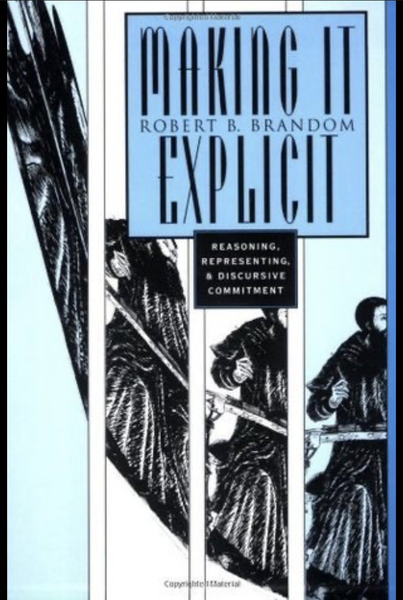

***

<a href="pdfs/2421_Syllabus.pdf">Syllabus</a>

<a href="pdfs/Some_General_Resources_on_Brandom_a.pdf">Some General Resources on Brandom's Philosophy of Language</a>

<a href="pdfs/Inferentialism_Normative_Pragmatism_and_3.pdf">Brandom's Dewey Lectures (Shanghai, 2018): "Inferentialism, Normative Pragmatism, and Metalinguistic Expressivism"</a>

***

## Week 1: Introduction

##### Week 1 Materials

- [Handout for Week 1](pdfs/Handout_Week_1_18-8-29_b.pdf)
- [Week 1 Notes](pdfs/Introduction_Week_1_Notes_18-8-29_n.pdf)
- ["Intentionality and Language: A Normative, Pragmatist, Inferentialist Approach"](pdfs/Intentionality_and_Language_A_Normative_2.pdf)
- [Introduction to *Articulating Reasons*](pdfs/Introduction_to_Articulating_Reasons.pdf)
- [Preface to *Making It Explicit*](pdfs/MIE_Preface.pdf)
- [Audio Recording of Week 1, Part One](https://archive.org/download/brandom-philosophy-of-language-2018/Week_1.1_August_29th.mp3)
- [Audio Recording of Week 1, Part Two](https://archive.org/download/brandom-philosophy-of-language-2018/Week_1.2_August_29th.mp3)

***

## Week 2: Normative Pragmatics and Analytic Pragmatism

##### Week 2 Materials

- [Week 2 Notes](pdfs/Week_2_Normativity_Notes_18-9-5_h.pdf)
- [*MIE* Chapter One: Toward a Normative Pragmatics](pdfs/MIE_Ch_1.pdf)
- [*BSD* Chapter One: Extending the Project of Analysis](pdfs/BSD_Chap_1.pdf)
- [Audio Recording of Week 2, Part One](https://archive.org/download/brandom-philosophy-of-language-2018/Week_2.1_September_5th.mp3)
- [Audio Recording of Week 2, Part Two](https://archive.org/download/brandom-philosophy-of-language-2018/Week_2.2_September_5th.mp3)

***

## Week 3: Semantic Inferentialism and Logical Expressivism

##### Week 3 Materials

- [Week 3 Notes](pdfs/Week_3_Notes_18-9-12_e.pdf)
- [*Articulating Reasons* Chapter One: Semantic Inferentialism and Logical Expressivism](pdfs/AR1HUPb.pdf)
- [*MIE* Chapter Two: Towards an Inferential Semantics](pdfs/MIE_Ch_2.pdf)
- [*BSD* Chapter Two: Elaborating Abilities: The Expressive Role of Logic](pdfs/BSD_2.pdf)
- [Audio Recording of Week 3, Part One](https://archive.org/download/brandom-philosophy-of-language-2018/Week_3.1_September_12th.mp3)
- [Audio Recording of Week 3, Part Two](https://archive.org/download/brandom-philosophy-of-language-2018/Week_3.2_September_12th.mp3)

##### Supplementary Materials for Week 3

- ["Truth and Assertibility"](pdfs/Truth_and_Assertibility.pdf)
- ["From Logical Expressivism to Expressivist Logics"](pdfs/From_Logical_Expressivism_to_Expressivist_Logic.pdf)
- ["How Analytic Philosophy Has Failed Cognitive Science"](pdfs/How_Analytic_Philosophy_Has_Failed_Cogni.pdf)
- ["Adequacy and the Individuation of Ideas in Spinoza's *Ethics*"](pdfs/Adequacy_and_the_Individuation_of_Ideas_in_Spinozas_Ethics.pdf)
- ["Leibniz and Degrees of Perception"](pdfs/LADP_brandom.pdf)

***

## Week 4: Pragmatics as Discursive Scorekeeping

##### Week 4 Materials

- [Week 4 Notes](pdfs/Week_4_Notes_18-9-19_n.pdf)
- [*MIE* Chapter Three: Linguistic Practice and Discursive Commitment](pdfs/MIE_Ch_3.pdf)
- [*BSD* Chapter Three: Artificial Intelligence and Analytic Pragmatism](pdfs/BSD_3_Chap_3.pdf)
- ["Conceptual Content and Discursive Practice"](pdfs/Conceptual_Content_and_Discursive_Practi.pdf)
- [Audio Recording of Week 4, Part One](https://archive.org/download/brandom-philosophy-of-language-2018/Week_4.1_September_19th.mp3)
- [Audio Recording of Week 4, Part Two](https://archive.org/download/brandom-philosophy-of-language-2018/Week_4.2_September_19th.mp3)

##### Supplementary Materials for Week 4

- [John MacFarlane's GOGAR](pdfs/John_MacFarlanes_GoGAR.pdf)
- ["Asserting"](pdfs/Asserting.pdf)
- ["Fighting Skepticism with Skepticism"](pdfs/Fighting_Skepticism_with_Skepticism.pdf)

***

## Week 5: Perception and Action

##### Week 5 Materials

- [Week 5 Notes](pdfs/Week_5_Notes_1_18-9-26_a.pdf)
- [*Articulating Reasons* Chapter Three: Insights and Blindspots of Reliabilism](pdfs/AR3HUP.pdf)
- [*Articulating Reasons* Chapter Two: Action, Norms, and Practical Reasoning](pdfs/AR2HUP.pdf)
- [*Making It Explicit* Chapter Four: Perception and Action](pdfs/MIE_Ch_4.pdf)
- [Audio Recording of Week 5, Part One](https://archive.org/download/brandom-philosophy-of-language-2018/Week_5.1_Sept_26th.mp3)
- [Audio Recording of Week 5, Part Two](https://archive.org/download/brandom-philosophy-of-language-2018/Week_5.2_Sept_26th.mp3)

##### Supplementary Materials for Week 5

- [Sellars: "Some Reflections on Language Games"](pdfs/Sellars_Some_Reflections_on_Language_Games.pdf)
- ["The Centrality of Sellars's Two-Ply Account of Observation"](pdfs/Centrality_of_Sellars_Two-Ply_Account_of_Observation.pdf)
- ["Noninferential Knowledge, Secondary Qualities, and Perceptual Experience"](pdfs/NIKPESQ831a.pdf)
- ["What Do Expressions of Preference Express?"](pdfs/What_Do_Expressions_of_Preference_Expres.pdf)

***

## Week 6: Deontic and Alethic Modal Vocabulary

##### Week 6 Materials

- [Week 6 Handout](pdfs/Week_6_Handout_18-10-3_g.pdf)
- [Week 6 Notes](pdfs/Week_Six_Notes_combined_18-10-3_g.pdf)
- [Audio Recording of Week 6, Part One](https://archive.org/download/brandom-philosophy-of-language-2018/Week_6.1_October_3rd.mp3)
- [Audio Recording of Week 6, Part Two](https://archive.org/download/brandom-philosophy-of-language-2018/Week_6.2_October_3rd.mp3)

##### Supplementary Materials for Week 6

- [*Analytic Pragmatism, Expressivism, and Modality*](pdfs/Analytic_Pragmatism_Expressivism_and_Mod.pdf)
- ["Modal Expressivism and Modal Realism: Together, Again"](pdfs/Modal_Expressivism_and_Modal_Realism_HUP.pdf)
- ["On the Way to a Pragmatist Theory of the Categories"](pdfs/On_the_Way_to_a_Pragmatist_Theory_of_the.pdf)
- ["Modality and Normativity: From Hume and Quine to Kant and Sellars"](pdfs/Modality_and_Normativity_From_Hume_and_Quine.pdf)

***

## Week 7: Singular Terms and Subsentential Structure

##### Week 7 Materials

- [Week 7 Handout 1](pdfs/WASTHND3.pdf)
- [Week 7 Handout 2](pdfs/Handout_UOSTN_17-2-17_a.pdf)
- [Week 7 Notes](pdfs/Week_7_Notes_18-10-10_h.pdf)
- [*Articulating Reasons* Chapter Four: What Are Singular Terms, and Why Are There Any?](pdfs/AR4HUP.pdf)
- [*Making It Explicit* Chapter Six: Substitution](pdfs/MIE_Ch_6.pdf)
- [Audio Recording of Week 7, Part One](https://archive.org/download/brandom-philosophy-of-language-2018/Week_7.1_October_10th.mp3)
- [Audio Recording of Week 7, Part Two](https://archive.org/download/brandom-philosophy-of-language-2018/Week_7.2_October_10th.mp3)

##### Supplementary Materials for Week 7

- ["Singular Terms and Sentential Sign Designs"](pdfs/Brandom_Singular_Terms_and_Sentential_Sign_Designs.pdf)
- [van Fraassen: "Quantification as an Act of Mind"](pdfs/Quantification_as_an_act_of_mind.pdf)
- ["Understanding the Object/Property Structure in Terms of Negation"](pdfs/Understanding_the_Object_Property_Struct.pdf)
- ["The Significance of Complex Numbers for Frege's Philosophy of Mathematics"](pdfs/Significance_of_Complex_Numbers_for_Freges_Philosophy_of_Mathematics.pdf)

***

## Week 8: Anaphora and Token-Recurrence Structures

##### Week 8 Materials

- [Week 8 Handout](pdfs/Week_8_Handout_18-10-17_b.pdf)
- [Week 8 Notes](pdfs/Week_8_Notes_on_Anaphora_18-10-18_b.pdf)
- [*MIE* Chapter Five](pdfs/MIE_Ch_5.pdf)
- [*MIE* Chapter Seven](pdfs/MIE_Ch_7.pdf)
- [Audio Recording of Week 8, Part One](https://archive.org/download/brandom-philosophy-of-language-2018/Week_8.1_October_17th.mp3)
- [Audio Recording of Week 8, Part Two](https://archive.org/download/brandom-philosophy-of-language-2018/Week_8.2_October_17th.mp3)

##### Supplementary Materials for Week 8

- ["Explanatory vs. Expressive Deflationism about Truth"](pdfs/Explanatory_vs_Expressive_Deflationism.pdf)
- ["Reference Explained Away"](pdfs/Reference_Explained_Away.pdf)

***

## Week 9: Ascriptions of Propositional Attitude: *De Dicto* and *De Re*

##### Week 9 Materials

- [Week 9 Handout](pdfs/Handout_Week_9_18-10-24_e.pdf)
- [Week 9 Notes](pdfs/Week_9_Notes_18-10-24_h.pdf)
- [Audio Recording of Week 9, Part One](https://archive.org/download/brandom-philosophy-of-language-2018/Week_9.1_October_24th.mp3)
- [Audio Recording of Week 9, Part Two](https://archive.org/download/brandom-philosophy-of-language-2018/Week_9.2_October_24th.mp3)

##### Supplementary Materials for Week 9

- ["Hermeneutic Practices and Theories of Meaning"](pdfs/Hermeneutic_Practices_and_Theories_of_Meaning.pdf)

***

## Week 10: Proper Names, Indexicals, and Representation

##### Week 10 Materials

- [Week 10 Handout](pdfs/Week_10_Handout_2421_18-10-31_i.pdf)
- [Week 10 Notes](pdfs/Week_10_Notes_2_18-10-31_j.pdf)
- [*Articulating Reasons* Chapter Six: Objectivity and the Normative Fine Structure of Rationality](pdfs/AR6HUPc.pdf)
- [Audio Recording of Week 10, Part One](https://archive.org/download/brandom-philosophy-of-language-2018/Week_10.1_October_31st.mp3)
- [Audio Recording of Week 10, Part Two](https://archive.org/download/brandom-philosophy-of-language-2018/Week_10.2_October_31st.mp3)

***

## Week 11: Normativity, Modality, and Intentionality

##### Week 11 Materials

- [Week 11 Notes](pdfs/Week_11_Plan_for_Normativity_Modality_and_Intentionality_18-11-7_k.pdf)
- [*BSD* Chapter Six: Intentionality as a Pragmatically Mediated Semantic Relation](pdfs/06-Brandom-Chap06.pdf)
- [Audio Recording of Week 11, Part One](https://archive.org/download/brandom-philosophy-of-language-2018/Week_11.1_November_7th.mp3)
- [Audio Recording of Week 11, Part Two](https://archive.org/download/brandom-philosophy-of-language-2018/Week_11.2_November_7th.mp3)

***

## Week 12: Discursive Practice and Semantic and Pragmatic Theory

##### Week 12 Materials

- [Week 12 Notes](pdfs/Week_12_notes_18-11-14_s.pdf)
- [*MIE* Chapter Nine: Conclusion](pdfs/MIE_Ch9.pdf)
- [Audio Recording of Week 12, Part One](https://archive.org/download/brandom-philosophy-of-language-2018/Week_12.1_November_14th.mp3)
- [Audio Recording of Week 12, Part Two](https://archive.org/download/brandom-philosophy-of-language-2018/Week_12.2_November_14th.mp3)

***

## Week 13: Conclusion

##### Week 13 Materials

- [Week 13 Handout](pdfs/Handout_for_Week_13_18-12-5_h.pdf)
- [Week 13 Notes](pdfs/Week_13_Notes_Two_18-12-1_e.pdf)
- [*AR* Introduction](pdfs/ARIntRev621a.pdf)
- [Review of Turbanti's *Robert Brandom's Normative Inferentialism*](pdfs/Review_of_Turbanti_Robert_Brandoms_Normative_Inferentialism.pdf)
- [*Tales of the Mighty Dead* Chapter One: Contexts](pdfs/TMD1ContextsHUPc.pdf)
- ["Pre-Hegelian Stages in the Metaphysics of Normativity" ('Lost' chapter of *A Spirit of Trust*)](pdfs/PreHegelian_Stages_in_the_History_of_the.pdf)
